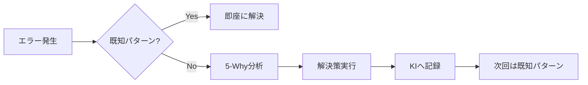

# 🤖 Antigravity: 完全自律成長・駆動型IDE

> **Vision**: ユーザーの思考速度で動き、自己学習・自己改善し続けるAIパートナー

---

## アーキテクチャ概要

```
┌─────────────────────────────────────────────────────────────┐
│                    USER REQUEST                              │
└─────────────────────────────────────────────────────────────┘
                              │
                              ▼
┌─────────────────────────────────────────────────────────────┐
│  🧠 THINKING LAYER (思考層)                                  │
│  ┌─────────────────┐  ┌─────────────────┐                   │
│  │ First Principles │  │ Persona         │                   │
│  │ (根本原因分析)    │  │ Orchestration   │                   │
│  └─────────────────┘  │ (多視点検証)     │                   │
│                       └─────────────────┘                   │
└─────────────────────────────────────────────────────────────┘
                              │
                              ▼
┌─────────────────────────────────────────────────────────────┐
│  ⚡ EXECUTION LAYER (実行層)                                 │
│  ┌─────────────┐  ┌─────────────┐  ┌─────────────┐         │
│  │ Workflows   │  │ Skills      │  │ MCP Servers │         │
│  │ (標準フロー) │  │ (専門機能)  │  │ (外部連携)   │         │
│  └─────────────┘  └─────────────┘  └─────────────┘         │
└─────────────────────────────────────────────────────────────┘
                              │
                              ▼
┌─────────────────────────────────────────────────────────────┐
│  📚 KNOWLEDGE LAYER (知識層)                                 │
│  ┌─────────────────────────────────────────────────────┐   │
│  │ Knowledge Items (KI)                                 │   │
│  │ - 過去の学習から蓄積した知識                          │   │
│  │ - エラーパターンと解決策                              │   │
│  │ - プロジェクト固有の知見                              │   │
│  └─────────────────────────────────────────────────────┘   │
└─────────────────────────────────────────────────────────────┘
                              │
                              ▼
┌─────────────────────────────────────────────────────────────┐
│  🔄 FEEDBACK LOOP (成長ループ)                               │
│  ┌───────┐    ┌───────┐    ┌───────┐    ┌───────┐         │
│  │ 実行  │ →  │ 検証  │ →  │ 学習  │ →  │ 改善  │ → ...   │
│  └───────┘    └───────┘    └───────┘    └───────┘         │
└─────────────────────────────────────────────────────────────┘
```

---

## ワークフロー体系 (21件)

### 🔄 ライフサイクル管理
| コマンド | 説明 | 自動化レベル |
|---------|------|-------------|
| `/checkin` | セッション開始・環境初期化 | 🟢 Full Auto |
| `/checkout` | セッション終了・データ整理 | 🟢 Full Auto |
| `/cleanup-48h` | 48h経過キャッシュ削除 | 🟢 Full Auto |
| `/lightweight` | システム軽量化 | 🟢 Full Auto |

### 🛠️ 開発フロー
| コマンド | 説明 | 自動化レベル |
|---------|------|-------------|
| `/dev` | 開発サーバー起動 | 🟢 Full Auto |
| `/build` | 本番ビルド | 🟢 Full Auto |
| `/test` | テスト実行 | 🟢 Full Auto |
| `/deploy` | 本番デプロイ | 🟡 Semi Auto |
| `/db-migrate` | DBマイグレーション | 🟡 Semi Auto |

### 🎯 タスクフロー
| コマンド | 説明 | 自動化レベル |
|---------|------|-------------|
| `/new-feature` | 新機能開発 | 🟡 Semi Auto |
| `/bug-fix` | バグ修正 | 🟡 Semi Auto |
| `/refactor` | リファクタリング | 🟡 Semi Auto |

### ✅ 品質保証
| コマンド | 説明 | 自動化レベル |
|---------|------|-------------|
| `/fbl` | Feedback Loop (120%品質) | 🟢 Full Auto |
| `/verification-loop` | 軽量検証ループ | 🟢 Full Auto |
| `/debate` | Multi-Persona Debate | 🟡 Semi Auto |

### 📢 発信・学習
| コマンド | 説明 | 自動化レベル |
|---------|------|-------------|
| `/checkpoint_to_blog` | 作業→ブログ変換 | 🟡 Semi Auto |
| `/publish` | 記事配信ワークフロー | 🟡 Semi Auto |
| `/learn_from_blog` | 記事から学習 | 🟡 Semi Auto |

### 🌐 環境管理
| コマンド | 説明 | 自動化レベル |
|---------|------|-------------|
| `/project-init` | プロジェクト初期化 | 🟡 Semi Auto |
| `/clone-environment` | 環境複製 | 🟡 Semi Auto |

---

## スキル体系 (12件)

### 🧠 思考スキル
| スキル | 発動条件 | 出力 |
|-------|---------|------|
| `first-principles` | 「なぜ」「根本原因」キーワード | 5-Why分析結果 |
| `architecture` | 設計決定が必要な時 | ADR文書 |
| `bottleneck-hunter` | パフォーマンス問題 | ボトルネック特定 |

### ⚡ 実行スキル
| スキル | 発動条件 | 出力 |
|-------|---------|------|
| `autonomous-execution` | 複雑なタスク | タスクツリー・実行ログ |
| `code-review` | コード変更後 | レビューレポート |

### 🎭 協調スキル
| スキル | 発動条件 | 出力 |
|-------|---------|------|
| `persona-orchestration` | 品質検証・複雑な判断 | Multi-Persona議論 |

### 🔧 運用スキル
| スキル | 発動条件 | 出力 |
|-------|---------|------|
| `docker-autonomous-ops` | Docker操作 | コンテナ管理 |
| `homebrew-autonomous-ops` | パッケージ管理 | システム設定 |
| `workspace-config-audit` | 設定ファイル監査 | 設定レポート |

### 📡 連携スキル
| スキル | 発動条件 | 出力 |
|-------|---------|------|
| `mcp-best-practices` | MCP開発 | サーバー設定 |
| `llm-api-best-practices` | LLM API統合 | API設定 |
| `discord-best-practices` | Discord Bot開発 | Bot実装 |

---

## ナレッジ体系 (11件)

| ナレッジ | カバー範囲 |
|---------|-----------|
| `antigravity_portable_dev_ecosystem` | SSD開発環境・運用標準 |
| `ai_coding_assistant_best_practices` | AI Coding設定・ルール |
| `video_editing_pipeline_videdit` | Videditパイプライン |
| `discord_buddy_ecosystem` | Discord Buddy全体 |
| `hype_buddy` | Hype Buddy実装 |
| `artistory_studio` | ARTISTORY STUDIO |
| `portable_studio_app` | Portable Studio |
| `database_management_and_deployment` | DB運用パターン |
| `mcp_server_directory` | MCPサーバー一覧 |
| `high_fidelity_ux_audit_patterns` | UX監査パターン |
| `soloprostudio_social_knowledge_ecosystem` | 発信戦略・ナラティブ |

---

## 自律成長メカニズム

### 1. 自動学習トリガー



### 2. 日次ルーティン（ユーザー実践）

**プロジェクト立ち上げ時:**
```
/project-init → 初期設定完了
```

**通常の開発日:**
```
┌─────────────────────────────────────────────────────────────┐
│  🌅 セッション開始                                           │
│  /checkin → 環境準備・同期完了                               │
└─────────────────────────────────────────────────────────────┘
                               │
                               ▼
┌─────────────────────────────────────────────────────────────┐
│  💻 開発作業                                                 │
│  /dev → /new-feature or /bug-fix → /fbl                     │
└─────────────────────────────────────────────────────────────┘
                               │
                               ▼
┌─────────────────────────────────────────────────────────────┐
│  ☕ 休憩ごと（チェックポイント）                             │
│  /checkpoint_to_blog → 学びをブログ化 → Notion投稿           │
│  git commit → 進捗を記録                                     │
└─────────────────────────────────────────────────────────────┘
                               │
                               ▼
┌─────────────────────────────────────────────────────────────┐
│  🌙 セッション終了                                           │
│  /checkout → 自己評価 → 改善提案 → ルール/スキル更新         │
└─────────────────────────────────────────────────────────────┘
```

**ルーティン起点のワークフロー自動起動:**
| ルーティン | 自動起動するワークフロー |
|-----------|-------------------------|
| `/checkin` | cleanup-48h, sync workflows/skills |
| `/checkpoint_to_blog` | git commit, blog generation, notion upload |
| `/checkout` | self-evaluation, kaizen implementation |

### 3. ペルソナ進化

- **HR Director**: タスクを分析し最適チームを自動編成
- **Core Personas**: 品質を担保する固定メンバー
- **Intern Personas**: 実績で昇格する成長型メンバー

---

## 同期プロトコル

### `/checkin`実行時
1. 一時データ削除
2. グローバルワークフロー → プロジェクトへ同期
3. グローバルスキル → プロジェクトへ同期
4. 環境最新化完了

### `/checkout`実行時
1. 未保存の学習をKI化
2. 改善提案を記録
3. 次回セッションへ引き継ぎ

---

## ディレクトリ構造

```
/Volumes/PortableSSD/.antigravity/
├── agent/
│   ├── rules/           # グローバルルール
│   │   └── user_global.md
│   ├── workflows/       # 21件のワークフロー
│   │   ├── checkin.md
│   │   ├── checkout.md
│   │   ├── fbl.md
│   │   └── ...
│   ├── skills/          # 12件のスキル
│   │   ├── first-principles/
│   │   ├── autonomous-execution/
│   │   ├── persona-orchestration/
│   │   └── ...
│   └── scripts/         # ユーティリティスクリプト
└── knowledge/           # 11件のナレッジアイテム
    ├── antigravity_portable_dev_ecosystem/
    ├── ai_coding_assistant_best_practices/
    └── ...
```

---

## 次のマイルストーン

- [ ] ペルソナ自動昇格・降格システムの実装
- [ ] エラーパターン自動記録の強化
- [ ] KI自動生成トリガーの追加
- [ ] `/evolve` コマンド: スキル・ルールの自己改善提案
