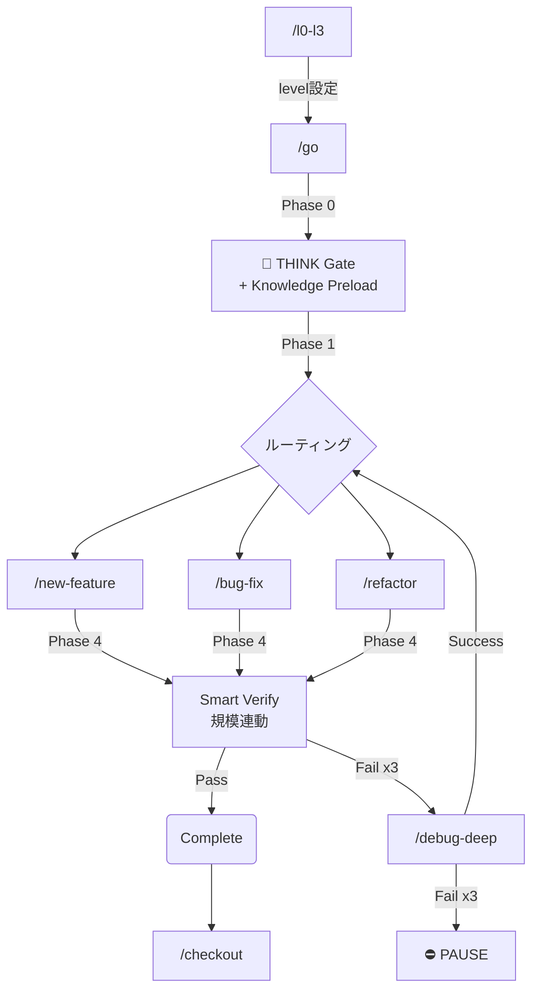
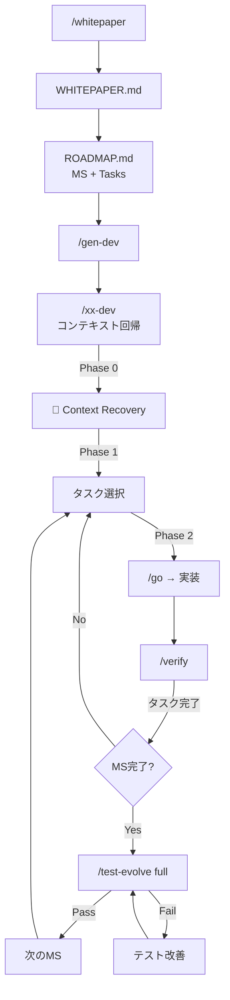

# WORKFLOW ROUTER (Consolidated)

## 🏗️ Session Partitioning Model (Think/Go/Verify)

プロジェクトの状態は `PROJECT_STATE.md` で管理され、作業は `git worktree` で物理的に分離されます。

| フェーズ | コマンド | 役割 |
|---|---|---|
| **Planning** | `/think "Task"` | 計画・設計・新規Worktree/Branch作成。<br>`PROJECT_STATE.md` にタスク登録。 |
| **Execution** | `/go "Task"` | 実装・コーディング。<br>Fuzzy Matchで該当Worktreeへ移動。 |
| **Verification** | `/verify` | 品質保証 (Test + Error Sweep + UX Check)。<br>完了時に `PROJECT_STATE.md` を更新。 |
| **PR / Reporting** | `/blog` | 広報・レポート作成。<br>プロジェクト動向を把握し記事化する。 |

---

## 🧭 コマンドマッピング

### Primary Commands (The Big Four + One)
| コマンド | WF | トリガー / 備考 |
|---------|-----|----------------|
| **`/setup`** | setup.md | 「プロジェクト開始」「初期化」<br>`PROJECT_STATE.md` 生成 |
| **`/think`** | think.md | 「新しいタスク」「計画」「設計」 |
| **`/go`** | go.md | 「実装」「続きをやる」「(タスク名)」<br>THINK Gate + ルーティング + Smart Verify 統合 |
| **`/verify`** | verify.md | 「テスト」「検証」<br>規模連動 Verify Chain（Quick/Standard/Deep） |
| **`/blog`** | blog.md | 「ブログ」「記事化」「広報」「レポート」 |

### Strategy Commands (Whitepaper-Driven Development)
| コマンド | WF | トリガー / 備考 |
|---------|-----|----------------|
| **`/whitepaper`** | whitepaper.md | 「ビジョン策定」「ホワイトペーパー」「戦略」<br>WHITEPAPER.md + ROADMAP.md 生成 |
| **`/gen-dev`** | gen-dev.md | 「devコマンド生成」<br>`/whitepaper` Phase 5 で自動呼出し |
| **`/xx-dev`** | [project]/.agent/workflows/ | プロジェクト固有。コンテキスト回帰 |

### Utility Commands
| コマンド | WF | 役割 |
|---------|-----|------|
| `/checkin` | checkin.md | 環境同期 (バックグラウンド実行推奨) |
| `/checkout` | checkout.md | セッション終了、自己評価 |
| `/worktree` | worktree.md | Worktreeの手動管理 |
| `/level` | level.md | 自律レベル変更 |
| `/evolve` | evolve.md | 自己進化・改善提案 |

### Internal / Advanced (直接呼び出し非推奨)
| コマンド | WF | 備考 |
|---------|-----|------|
| `/ship` | ship.md | `/verify` 後のデプロイ |
| `/debug-deep` | debug-deep.md | 検証失敗時のエスカレーション |
| `/test-evolve` | test-evolve.md | テスト品質の自律進化ループ |
| `/ux-audit` | ux-audit.md | Lighthouse + axe-core UX自動監査 |
| `/galileo` | galileo.md | Deep Verification |
| `/debate` | debate.md | Review / Planning Support（実装まで進む）|
| `/refine` | refine.md | **純粋議論専用**。実装禁止ガード付きディベートラウンドでプロジェクトを詰める |

---

## 🔄 メインフロー



### Whitepaper-Driven Flow（長期戦略型）



## ⚡️ Parallel Execution
Fuzzy Match により、タスク名 (`login` 等) を指定するだけで適切な Worktree に移動します。

```bash
/go login  --> ../worktrees/feat-login へ移動
/go pay    --> ../worktrees/feat-payment へ移動
```

---

## 優先ルール

1.  **State Driven**: 全てのアクションは `PROJECT_STATE.md` に記録されるべきである。
2.  **Context Follows Git**: AIのコンテキストは、現在の Worktree/Branch に従う。
3.  **Quality First**: 曖昧な指示には、勝手な判断をせずユーザーに確認を求める。
