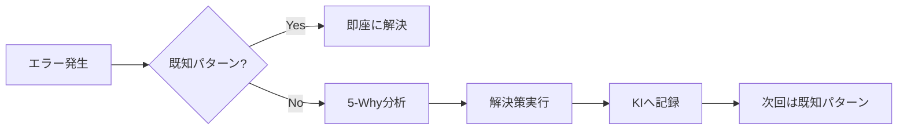

# 🤖 Antigravity: 完全自律成長・駆動型IDE

> **Vision**: ユーザーの思考速度で動き、自己学習・自己改善し続けるAIパートナー

---

## アーキテクチャ概要

```
┌─────────────────────────────────────────────────────────────┐
│                    USER REQUEST                              │
└─────────────────────────────────────────────────────────────┘
                              │
                              ▼
┌─────────────────────────────────────────────────────────────┐
│  🧠 THINKING LAYER (思考層)                                  │
│  ┌─────────────────┐  ┌─────────────────┐                   │
│  │ First Principles │  │ Persona         │                   │
│  │ (根本原因分析)    │  │ Orchestration   │                   │
│  └─────────────────┘  │ (多視点検証)     │                   │
│                       └─────────────────┘                   │
└─────────────────────────────────────────────────────────────┘
                              │
                              ▼
┌─────────────────────────────────────────────────────────────┐
│  ⚡ EXECUTION LAYER (実行層)                                 │
│  ┌─────────────┐  ┌─────────────┐  ┌─────────────┐         │
│  │ Workflows   │  │ Skills      │  │ MCP Servers │         │
│  │ (標準フロー) │  │ (専門機能)  │  │ (外部連携)   │         │
│  └─────────────┘  └─────────────┘  └─────────────┘         │
└─────────────────────────────────────────────────────────────┘
                              │
                              ▼
┌─────────────────────────────────────────────────────────────┐
│  📚 KNOWLEDGE LAYER (知識層)                                 │
│  ┌─────────────────────────────────────────────────────┐   │
│  │ Knowledge Items (KI)                                 │   │
│  │ - 過去の学習から蓄積した知識                          │   │
│  │ - エラーパターンと解決策                              │   │
│  │ - プロジェクト固有の知見                              │   │
│  └─────────────────────────────────────────────────────┘   │
└─────────────────────────────────────────────────────────────┘
                              │
                              ▼
┌─────────────────────────────────────────────────────────────┐
│  🔄 FEEDBACK LOOP (成長ループ)                               │
│  ┌───────┐    ┌───────┐    ┌───────┐    ┌───────┐         │
│  │ 実行  │ →  │ 検証  │ →  │ 学習  │ →  │ 改善  │ → ...   │
│  └───────┘    └───────┘    └───────┘    └───────┘         │
└─────────────────────────────────────────────────────────────┘
```

---

## ワークフロー体系 (46件)

### 🔄 ライフサイクル管理
| コマンド | 説明 | 自動化レベル |
|---------|------|-------------|
| `/go` | 統合メタワークフロー | 🟢 Full Auto |
| `/work` | /goへリダイレクト（後方互換） | 🟢 Full Auto |
| `/checkin` | セッション開始・環境初期化 | 🟢 Full Auto |
| `/checkout` | セッション終了・データ整理 | 🟢 Full Auto |
| `/lightweight` | システム軽量化 | 🟢 Full Auto |
| `/level` | 自律レベル切替 | 🟢 Full Auto |
| `/l0`〜`/l3` | レベル即時切替 | 🟢 Full Auto |

### 🛠️ 開発フロー
| コマンド | 説明 | 自動化レベル |
|---------|------|-------------|
| `/spec` | 新機能仕様策定 | 🟡 Semi Auto |
| `/new-feature` | 新機能開発 | 🟡 Semi Auto |
| `/bug-fix` | バグ修正 | 🟡 Semi Auto |
| `/refactor` | リファクタリング | 🟡 Semi Auto |
| `/dev` | 開発サーバー起動 | 🟢 Full Auto |
| `/build` | 本番ビルド | 🟢 Full Auto |
| `/test` | テスト実行 | 🟢 Full Auto |
| `/deploy` | 本番デプロイ | 🟡 Semi Auto |
| `/db-migrate` | DBマイグレーション | 🟡 Semi Auto |
| `/ship` | リリース準備一括実行 | 🟡 Semi Auto |

### ✅ 品質保証
| コマンド | 説明 | 自動化レベル |
|---------|------|-------------|
| `/verify` | Risk-Based検証チェーン | 🟢 Full Auto |
| `/fbl` | Feedback Loop (120%品質) | 🟢 Full Auto |
| `/error-sweep` | 徹底エラーチェック | 🟢 Full Auto |
| `/debate` | Multi-Persona Debate | 🟡 Semi Auto |
| `/debug-deep` | ディープデバッグ | 🟡 Semi Auto |
| `/fullcheck` | 全30レイヤー品質チェック | 🟢 Full Auto |
| `/test-evolve` | テスト自己進化ループ | 🟢 Full Auto |
| `/ux-audit` | UXパフォーマンス監査 | 🟢 Full Auto |

### 🧠 戦略・ビジョン
| コマンド | 説明 | 自動化レベル |
|---------|------|-------------|
| `/whitepaper` | ホワイトペーパー共創 | 🟡 Semi Auto |
| `/gen-dev` | ロードマップ→タスク自動生成 | 🟡 Semi Auto |
| `/vision-os` | 3巨頭ビジョン駆動開発 | 🟡 Semi Auto |
| `/refine` | 純粋議論ワークフロー | 🟡 Semi Auto |
| `/galileo` | ガリレオテスト | 🟡 Semi Auto |
| `/think` | 構造化思考 | 🟡 Semi Auto |
| `/lp` | 成約率特化LP構成案 | 🟡 Semi Auto |

### 📢 発信・学習
| コマンド | 説明 | 自動化レベル |
|---------|------|-------------|
| `/blog` | 記事作成 | 🟡 Semi Auto |
| `/checkpoint_to_blog` | 作業→ブログ変換 | 🟡 Semi Auto |
| `/publish` | 記事配信ワークフロー | 🟡 Semi Auto |
| `/learn_from_blog` | 記事から学習 | 🟡 Semi Auto |

### 🔧 環境・進化
| コマンド | 説明 | 自動化レベル |
|---------|------|-------------|
| `/setup` | プロジェクト初期化・環境セットアップ | 🟡 Semi Auto |
| `/context-compression` | コンテキスト圧縮 | 🟢 Full Auto |
| `/evolve` | 自己進化・改善提案 | 🟢 Full Auto |
| `/evolve-wiz` | 進化型ウィザード | 🟡 Semi Auto |
| `/incident` | インシデント記録 | 🟢 Full Auto |

---

## スキル体系 (25件)

### 🧠 思考スキル
`first-principles` `architecture` `bottleneck-hunter`

### ⚡ 実行スキル
`autonomous-execution` `code-review` `context-compression`

### 🎭 協調スキル
`persona-orchestration` `skill-creator`

### 🔧 運用スキル
`docker-autonomous-ops` `homebrew-autonomous-ops` `railway-autonomous-ops` `workspace-config-audit` `immortal-agent-core`

### 📡 連携スキル
`mcp-best-practices` `mcp-builder` `llm-api-best-practices` `discord-best-practices`

### 🎨 フロントエンド・品質
`frontend-design` `react-best-practices` `high-conversion-lp-architect` `webapp-testing` `supabase-postgres-best-practices` `test-quality-engine` `ux-performance-audit` `world-class-test-patterns`

---

## ナレッジ体系 (23件)

`ai_coding_assistant_best_practices` `antigravity_portable_dev_ecosystem` `artistory_studio` `autonomous_feedback_loop_fbl` `database_management_and_deployment` `debug_patterns` `developer_behavioral_patterns_and_audit` `discord_buddy_ecosystem` `galileo_log` `gh_github_cli.md` `gws_google_workspace_cli.md` `high_fidelity_ux_audit_patterns` `learning_store` `mcp_server_directory` `openclaw_autonomous_ai_architecture` `persona_orchestration_system` `portable_studio_app` `remote_mac_mini_vibe_coding` `social_knowledge` `soloprostudio_social_knowledge_ecosystem` `test_evolution_patterns` `video_editing_pipeline_videdit` `x_cli_twitter.md`

---

## 自律成長メカニズム

### 1. 自動学習トリガー



### 2. 日次ルーティン（ユーザー実践）

**プロジェクト立ち上げ時:**
```
/setup → 初期設定完了
```

**通常の開発日:**
```
┌─────────────────────────────────────────────────────────────┐
│  🌅 セッション開始                                           │
│  /checkin → 環境準備・同期完了                               │
└─────────────────────────────────────────────────────────────┘
                               │
                               ▼
┌─────────────────────────────────────────────────────────────┐
│  💻 開発作業                                                 │
│  /dev → /new-feature or /bug-fix → /fbl                     │
└─────────────────────────────────────────────────────────────┘
                               │
                               ▼
┌─────────────────────────────────────────────────────────────┐
│  ☕ 休憩ごと（チェックポイント）                             │
│  /checkpoint_to_blog → 学びをブログ化 → Notion投稿           │
│  git commit → 進捗を記録                                     │
└─────────────────────────────────────────────────────────────┘
                               │
                               ▼
┌─────────────────────────────────────────────────────────────┐
│  🌙 セッション終了                                           │
│  /checkout → 自己評価 → 改善提案 → ルール/スキル更新         │
└─────────────────────────────────────────────────────────────┘
```

**ルーティン起点のワークフロー自動起動:**
| ルーティン | 自動起動するワークフロー |
|-----------|-------------------------|
| `/checkin` | lightweight, sync workflows/skills |
| `/checkpoint_to_blog` | git commit, blog generation, notion upload |
| `/checkout` | self-evaluation, kaizen implementation |

### 3. ペルソナ進化

- **HR Director**: タスクを分析し最適チームを自動編成
- **Core Personas**: 品質を担保する固定メンバー
- **Intern Personas**: 実績で昇格する成長型メンバー

---

## 同期プロトコル

### `/checkin`実行時
1. 一時データ削除
2. グローバルワークフロー → プロジェクトへ同期
3. グローバルスキル → プロジェクトへ同期
4. 環境最新化完了

### `/checkout`実行時
1. 未保存の学習をKI化
2. 改善提案を記録
3. 次回セッションへ引き継ぎ

---

## ディレクトリ構造

```
~/.antigravity/
├── agent/
│   ├── rules/           # グローバルルール
│   │   └── user_global.md
│   ├── workflows/       # 46件のワークフロー
│   │   ├── go.md
│   │   ├── checkin.md
│   │   ├── checkout.md
│   │   └── ...
│   ├── skills/          # 25件のスキル
│   │   ├── first-principles/
│   │   ├── autonomous-execution/
│   │   ├── persona-orchestration/
│   │   └── ...
│   └── scripts/         # 43件のユーティリティスクリプト
└── knowledge/           # 24件のナレッジアイテム
    ├── antigravity_portable_dev_ecosystem/
    ├── ai_coding_assistant_best_practices/
    └── ...
```

---

## 次のマイルストーン

- [ ] ペルソナ自動昇格・降格システムの実装
- [ ] エラーパターン自動記録の強化
- [ ] KI自動生成トリガーの追加
- [ ] `/evolve` コマンド: スキル・ルールの自己改善提案
