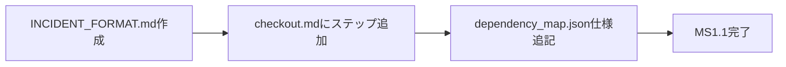
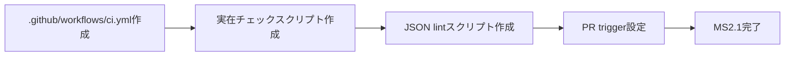

# Antigravity Core Self-Improving Pipeline — MILESTONES

> **参照**: ROADMAP.md / WHITEPAPER.md

---

## MS 1.1: brain_log 構造化フォーマット定義

**完了条件**: `INCIDENT_FORMAT.md` が作成され、AIが毎セッション末に自動出力できる

| # | タスク | 工数 | 依存 |
|---|--------|------|------|
| 1.1.1 | `INCIDENT_FORMAT.md` 作成（フォーマット定義 + サンプル） | 小 | — |
| 1.1.2 | `checkout.md` に構造化MDの自動出力ステップを追加 | 小 | 1.1.1 |
| 1.1.3 | `dependency_map.json` に brain_log セクション追記 | 小 | 1.1.2 |
| 1.1.4 | テスト: 1セッション実行して構造化MDが出力されることを確認 | 小 | 1.1.3 |

---

## MS 2.1: GitHub Actions 依存マップ整合性CI

**完了条件**: PRのたびに `dependency_map.json` の整合性チェックが自動実行される

| # | タスク | 工数 | 依存 |
|---|--------|------|------|
| 2.1.1 | `.github/workflows/ci.yml` スケルトン作成 | 小 | — |
| 2.1.2 | `scripts/check_dependency_map.js` 作成（参照ファイル実在チェック） | 中 | 2.1.1 |
| 2.1.3 | JSON lint ステップ追加 | 小 | 2.1.1 |
| 2.1.4 | PR時に自動実行されることをテストPRで確認 | 小 | 2.1.2, 2.1.3 |

---

## MS 3.1: サーバー版 evolve エンジン（週次スケジュール）

**完了条件**: 週1回、incidents.md の OPEN インシデントを分析してPR草案を自動生成する

| # | タスク | 工数 | 依存 |
|---|--------|------|------|
| 3.1.1 | `server_evolve.js` 作成（incidents.md分析 + WF改善案生成） | 大 | MS2.1完了 |
| 3.1.2 | GitHub Actions scheduled trigger 設定（weekly） | 小 | 3.1.1 |
| 3.1.3 | 生成PRに `bot: evolve-proposal` ラベル付与 | 小 | 3.1.2 |
| 3.1.4 | テスト実行でPRが生成されることを確認 | 中 | 3.1.3 |

---

## MS 4.1: chaos_monkey.js CI統合

**完了条件**: chaos層テストが専用サンドボックスジョブで動き、失敗時にincidents.mdに自動記録される

| # | タスク | 工数 | 依存 |
|---|--------|------|------|
| 4.1.1 | `chaos_monkey.js` に期待値定義セクションを追加 | 中 | MS3.1完了 |
| 4.1.2 | GitHub Actions にサンドボックスジョブを追加（他ジョブと分離） | 中 | 4.1.1 |
| 4.1.3 | 失敗時に incidents.md へ自動記録するステップを追加 | 小 | 4.1.2 |
| 4.1.4 | Chaos層テスト実行で実践ハングが再現・検知されることを確認 | 大 | 4.1.3 |
