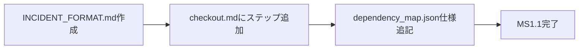
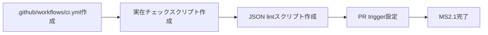
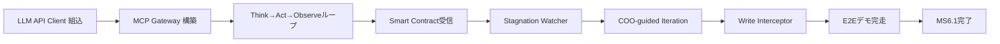
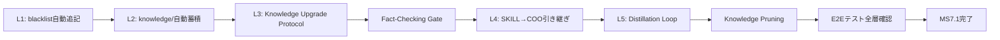

# Antigravity Core Self-Improving Pipeline — MILESTONES

> **参照**: ROADMAP.md / WHITEPAPER.md

---

## MS 1.1: brain_log 構造化フォーマット定義

**完了条件**: `INCIDENT_FORMAT.md` が作成され、AIが毎セッション末に自動出力できる

```mermaid
graph LR
  A[INCIDENT_FORMAT.md作成] --> B[checkout.mdにステップ追加]
  B --> C[dependency_map.json仕様追記]
  C --> D[MS1.1完了]
```

| # | タスク | 工数 | 依存 |
|---|--------|------|------|
| 1.1.1 | `INCIDENT_FORMAT.md` 作成（フォーマット定義 + サンプル） | 小 | — |
| 1.1.2 | `checkout.md` に構造化MDの自動出力ステップを追加 | 小 | 1.1.1 |
| 1.1.3 | `dependency_map.json` に brain_log セクション追記 | 小 | 1.1.2 |
| 1.1.4 | テスト: 1セッション実行して構造化MDが出力されることを確認 | 小 | 1.1.3 |

---

## MS 2.1: GitHub Actions 依存マップ整合性CI

**完了条件**: PRのたびに `dependency_map.json` の整合性チェックが自動実行される

```mermaid
graph LR
  A[.github/workflows/ci.yml作成] --> B[実在チェックスクリプト作成]
  B --> C[JSON lintスクリプト作成]
  C --> D[PR trigger設定]
  D --> E[MS2.1完了]
```

| # | タスク | 工数 | 依存 |
|---|--------|------|------|
| 2.1.1 | `.github/workflows/ci.yml` スケルトン作成 | 小 | — |
| 2.1.2 | `scripts/check_dependency_map.js` 作成（参照ファイル実在チェック） | 中 | 2.1.1 |
| 2.1.3 | JSON lint ステップ追加 | 小 | 2.1.1 |
| 2.1.4 | PR時に自動実行されることをテストPRで確認 | 小 | 2.1.2, 2.1.3 |

---

## MS 3.1: サーバー版 evolve エンジン（週次スケジュール）

**完了条件**: 週1回、incidents.md の OPEN インシデントを分析してPR草案を自動生成する

| # | タスク | 工数 | 依存 |
|---|--------|------|------|
| 3.1.1 | `server_evolve.js` 作成（incidents.md分析 + WF改善案生成） | 大 | MS2.1完了 |
| 3.1.2 | GitHub Actions scheduled trigger 設定（weekly） | 小 | 3.1.1 |
| 3.1.3 | 生成PRに `bot: evolve-proposal` ラベル付与 | 小 | 3.1.2 |
| 3.1.4 | テスト実行でPRが生成されることを確認 | 中 | 3.1.3 |

---

## MS 4.1: chaos_monkey.js CI統合

**完了条件**: chaos層テストが専用サンドボックスジョブで動き、失敗時にincidents.mdに自動記録される

| # | タスク | 工数 | 依存 |
|---|--------|------|------|
| 4.1.1 | `chaos_monkey.js` に期待値定義セクションを追加 | 中 | MS3.1完了 |
| 4.1.2 | GitHub Actions にサンドボックスジョブを追加（他ジョブと分離） | 中 | 4.1.1 |
| 4.1.3 | 失敗時に incidents.md へ自動記録するステップを追加 | 小 | 4.1.2 |
| 4.1.4 | Chaos層テスト実行で実践ハングが再現・検知されることを確認 | 大 | 4.1.3 |

---

## MS 5.1: Daemon Core Docker基盤 & Asynchronous Gateway

**完了条件**: `docker compose up` でDaemonが起動し、`/core-run` でタスクをPushすると自動検知・実行する

```mermaid
graph LR
  A[Dockerfile + compose.yml] --> B[Volume マウント検証]
  B --> C[HEALTHCHECK 自動再起動テスト]
  C --> D[/core-run CLI 作成]
  D --> E[Gateway Push→Daemon検知 E2Eテスト]
  E --> F[MS5.1完了]
```

| # | タスク | 工数 | 依存 |
|---|--------|------|------|
| 5.1.1 | `docker-core/Dockerfile` + `docker-compose.yml` の最終化・起動テスト | 中 | — |
| 5.1.2 | Volume マウント検証（コンテナ再起動後の `.session_state.json` 保持確認） | 小 | 5.1.1 |
| 5.1.3 | `HEALTHCHECK` による TTL超過時の自動再起動テスト | 中 | 5.1.2 |
| 5.1.4 | `/core-run` CLI スクリプト作成（`pending_tasks` へのJSON Push） | 小 | 5.1.2 |
| 5.1.5 | Gateway E2E: `/core-run` → Daemon検知 → ログ出力までの結合テスト | 中 | 5.1.3, 5.1.4 |

---

## MS 6.1: Headless LLM Agent Engine + Safety Mechanisms

**完了条件**: Daemon Core が LLM API で自律実装し、3つの安全装置（Stagnation Watcher / COO-guided Iteration / Write Interceptor）が機能する

```mermaid
graph LR
  A[LLM API Client 組込] --> B[MCP Gateway 構築]
  B --> C[Think→Act→Observeループ]
  C --> D[Smart Contract受信]
  D --> E[Stagnation Watcher]
  E --> F[COO-guided Iteration]
  F --> G[Write Interceptor]
  G --> H[E2Eデモ完走]
  H --> I[MS6.1完了]
```

| # | タスク | 工数 | 依存 |
|---|--------|------|------|
| 6.1.1 | `agent-loop.js` に Gemini API クライアントを組み込み | 中 | MS5.1完了 |
| 6.1.2 | MCP Host Server（Mac側）の実装（ファイルR/W + コマンド実行） | 大 | 6.1.1 |
| 6.1.3 | Think→Act→Observe（ReAct）ループの実装 | 大 | 6.1.2 |
| 6.1.4 | COO Smart Contract JSON の受信・遵守ロジック（品質閾値・メタルール・予算制約） | 中 | 6.1.3 |
| 6.1.5 | **Stagnation Watcher**: N回スコア改善なし → 自動 Suspend + COO レポート | 中 | 6.1.4 |
| 6.1.6 | **COO-guided Iteration**: COO Hint JSON を受け取り注入して再起動するロジック | 中 | 6.1.5 |
| 6.1.7 | **Write Interceptor**: 50行超 diff をステージング → COO 承認待機ループ | 中 | 6.1.3 |
| 6.1.8 | E2Eデモ: 「バグ付きコード修正 → `npm test` 全パス」を無人で完走 | 大 | 6.1.5, 6.1.6, 6.1.7 |

---

## MS 7.1: Self-Reinforcing Learning Loops — L1〜L5 複利閉ループ

**完了条件**: 5層の学習ループが全て機能し、セッションが重なるほど Daemon と COO の双方が指数的に賢くなる

```mermaid
graph LR
  A[L1: blacklist自動追記] --> B[L2: knowledge/自動蓄積]
  B --> C[L3: Knowledge Upgrade Protocol]
  C --> D[Fact-Checking Gate]
  D --> E[L4: SKILL→COO引き継ぎ]
  E --> F[L5: Distillation Loop]
  F --> G[Knowledge Pruning]
  G --> H[E2Eテスト全層確認]
  H --> I[MS7.1完了]
```

| # | タスク | 工数 | 依存 |
|---|--------|------|------|
| 7.1.1 | **L1**: 反復エラー（N回失敗）を `fatal_blacklist.json` に自動追記 | 中 | MS6.1完了 |
| 7.1.2 | **L2**: 解決策・成功パターンを `knowledge/` に構造化MDで自動蓄積 | 中 | 7.1.1 |
| 7.1.3 | **L3 Knowledge Upgrade Protocol**: 類似N件 → SKILL.md に汎化ルールを自動追記 | 大 | 7.1.2 |
| 7.1.4 | **Fact-Checking Gate**: 3タスク実証済みルールのみ SKILL 昇格（誤汎化防止） | 中 | 7.1.3 |
| 7.1.5 | **L4**: SKILL.md 更新が次セッションの COO 初期コンテキストに自動反映されることを検証 | 小 | 7.1.4 |
| 7.1.6 | **L5 Knowledge Distillation Loop**: `knowledge/` 蒸留エンジン実装（重複検出→圧縮→`knowledge/distilled/` 保存→`archived/` 退避） | 大 | 7.1.2 |
| 7.1.7 | **Knowledge Pruning**: 重要度低ナレッジの自動アーカイブ化（ノイズ制御） | 小 | 7.1.6 |
| 7.1.8 | E2Eテスト: 同じエラーが2回目に回避 / `distilled/` に原則保存 / SKILL引き継ぎを全層確認 | 大 | 7.1.5, 7.1.7 |
