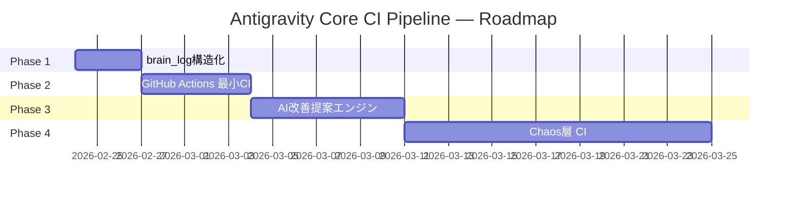

# Antigravity Core Self-Improving Pipeline — ROADMAP

> **作成日**: 2026-02-24
> **参照**: WHITEPAPER.md (refine/hang-log-global-correlation/)
> **ゴール**: CoreをサーバーサイドCIとして自律運転させ、学習ループを閉じる

---

## 全体タイムライン

---

## Phase 1: brain_log構造化（学習ループの入力源を定義）

**期間**: 〜2日
**戦闘力**: 現状 → 学習可能な状態

### 概要
brain_logを「Core読み取り可能な構造化MD形式」で定義する。
これにより手動の昇格判断ゼロで、実践ハングがサーバーに届く。

### 完了条件
- [ ] `INCIDENT_FORMAT.md` にbrain_log構造化フォーマットを定義
- [ ] `checkout.md` がセッション終了時に構造化MDを自動出力するステップを追加
- [ ] `dependency_map.json` に brain_log フォーマット仕様を追記

---

## Phase 2: GitHub Actions 最小CI

**期間**: 〜5日
**戦闘力**: 学習可能 → 自動検証付き

### 概要
`dependency_map.json` の整合性チェックと基本lintをCIで実行。
Core修正がブレイキングチェンジを起こさないことを自動保証。

### 完了条件
- [ ] `.github/workflows/ci.yml` 作成
- [ ] `dependency_map.json` の参照ファイル実在チェック
- [ ] JSON lint（壊れたdependency_mapのmerge防止）
- [ ] PR時に自動実行されることを確認

---

## Phase 3: AI改善提案エンジン（サーバー版）

**期間**: 〜7日
**戦闘力**: 自動検証付き → 自律改善提案付き

### 概要
`evolve.js` のサーバーサイド版。全ユーザーのincidents.mdと
構造化brain_logを分析してPRを自動生成する。

### 完了条件
- [ ] `agent/scripts/server_evolve.js` 作成
- [ ] GitHub Actions から呼び出されるスケジュール実行（weekly）
- [ ] 生成されたPRに自動ラベル `bot: evolve-proposal` を付与

---

## Phase 4: Chaos層 CI（サンドボックス版）

**期間**: 〜14日（サンドボックス確保後）
**戦闘力**: 自律改善提案付き → 完全自律進化

### 概要
`chaos_monkey.js` をCIに統合。意図的にハング状態を誘発し、
実践ハングを継続的に再現・修正・検証するループを形成。

### 完了条件
- [ ] chaos_monkey.js に「期待値定義」セクションを追加
- [ ] 専用サンドボックスジョブ（他のCIジョブと分離）
- [ ] 失敗時に自動でincidents.mdに記録するステップ

---

## 将来課題（Phase 5以降）

| 課題 | 対応時期 |
|------|---------|
| マルチユーザーコンフリクト仲裁 | OSS化後 |
| コールドスタート（初期テストスイート） | CI実装着手時 |
| バージョンスキュー管理 | 複数ユーザー参加後 |
