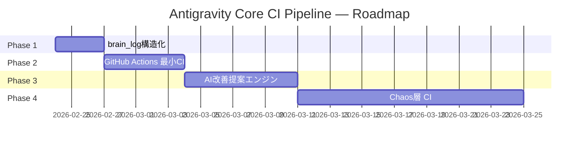

# Antigravity Core Self-Improving Pipeline — ROADMAP

> **作成日**: 2026-02-24
> **参照**: WHITEPAPER.md (refine/hang-log-global-correlation/)
> **ゴール**: CoreをサーバーサイドCIとして自律運転させ、学習ループを閉じる

---

## 全体タイムライン

```mermaid
gantt
  title Antigravity Core CI Pipeline — Roadmap
  dateFormat  YYYY-MM-DD
  section Phase 1
  brain_log構造化       :p1, 2026-02-24, 3d
  section Phase 2
  GitHub Actions 最小CI :p2, after p1, 5d
  section Phase 3
  AI改善提案エンジン    :p3, after p2, 7d
  section Phase 4
  Chaos層 CI            :p4, after p3, 14d
```

---

## Phase 1: brain_log構造化（学習ループの入力源を定義）

**期間**: 〜2日
**戦闘力**: 現状 → 学習可能な状態

### 概要
brain_logを「Core読み取り可能な構造化MD形式」で定義する。
これにより手動の昇格判断ゼロで、実践ハングがサーバーに届く。

### 完了条件
- [ ] `INCIDENT_FORMAT.md` にbrain_log構造化フォーマットを定義
- [ ] `checkout.md` がセッション終了時に構造化MDを自動出力するステップを追加
- [ ] `dependency_map.json` に brain_log フォーマット仕様を追記

---

## Phase 2: GitHub Actions 最小CI

**期間**: 〜5日
**戦闘力**: 学習可能 → 自動検証付き

### 概要
`dependency_map.json` の整合性チェックと基本lintをCIで実行。
Core修正がブレイキングチェンジを起こさないことを自動保証。

### 完了条件
- [ ] `.github/workflows/ci.yml` 作成
- [ ] `dependency_map.json` の参照ファイル実在チェック
- [ ] JSON lint（壊れたdependency_mapのmerge防止）
- [ ] PR時に自動実行されることを確認

---

## Phase 3: AI改善提案エンジン（サーバー版）

**期間**: 〜7日
**戦闘力**: 自動検証付き → 自律改善提案付き

### 概要
`evolve.js` のサーバーサイド版。全ユーザーのincidents.mdと
構造化brain_logを分析してPRを自動生成する。

### 完了条件
- [ ] `agent/scripts/server_evolve.js` 作成
- [ ] GitHub Actions から呼び出されるスケジュール実行（weekly）
- [ ] 生成されたPRに自動ラベル `bot: evolve-proposal` を付与

---

## Phase 4: Chaos層 CI（サンドボックス版）

**期間**: 〜14日（サンドボックス確保後）
**戦闘力**: 自律改善提案付き → 完全自律進化

### 概要
`chaos_monkey.js` をCIに統合。意図的にハング状態を誘発し、
実践ハングを継続的に再現・修正・検証するループを形成。

### 完了条件
- [ ] chaos_monkey.js に「期待値定義」セクションを追加
- [ ] 専用サンドボックスジョブ（他のCIジョブと分離）
- [ ] 失敗時に自動でincidents.mdに記録するステップ

---

## 将来課題（Phase 5以降） → **Daemon Core Architecture として具体化**

---

## Phase 5: Daemon Core Docker基盤 & Asynchronous Gateway

**期間**: 〜5日
**戦闘力**: 完全自律進化 → **Dockerコンテナによる不死身の実行基盤**

### 概要
Antigravity Coreの「実行エンジン」をMacネイティブからDockerコンテナへ移行。
`HEALTHCHECK` による自動蘇生（The Overseer）と、Docker Volumeによる状態永続化（State Hydration）を実装。
CLIからタスクを非同期Push（`/core-run`）する Asynchronous Gateway を構築。

### 完了条件
- [ ] `docker-core/Dockerfile` + `docker-compose.yml` が `docker compose up` で起動する
- [ ] `~/.antigravity/` が Volume マウントされ、コンテナ再起動後も `.session_state.json` が保持される
- [ ] `HEALTHCHECK` が TTL超過時にコンテナを自動再起動することをテスト確認
- [ ] `/core-run "タスク名"` CLI が `pending_tasks` にタスクを Push し、Daemon が検知する

---

## Phase 6: Headless LLM Agent Engine — COO-Daemon 完全駆動

**期間**: 〜14日
**戦闘力**: 不死身の実行基盤 → **自分で考えて実装し、詰まったらCOOと連携する完全自律ワーカー**

### 概要
`agent-loop.js` に Gemini API を直接組み込み、Think→Act→Observe の ReActループで
「タスク読込 → コード実装 → テスト実行 → エラー修正 → 品質閾値クリア」を無人で完遂する。
/debate deep で確定した3つの安全機構（Stagnation Watcher / COO-guided Iteration / Write Interceptor）も同時実装し、「暴走しない・詰まらない・壊さない」を保証する。

### 完了条件
- [ ] `agent-loop.js` が Gemini API を叩き、自律的にファイル読み書き・コマンド実行ができる
- [ ] MCP Host Server（Mac側）経由で Mac のファイルを操作できる
- [ ] COO Smart Contract JSON（品質閾値・メタルール・予算制約）を受け取り遵守する
- [ ] **Stagnation Watcher**: N回試行スコア改善なし → 自動 Suspend + COO レポート
- [ ] **COO-guided Iteration**: COO からの Hint JSON を受け取り、それを注入した状態で再起動できる
- [ ] **Write Interceptor**: 50行超 diff をステージングし、COO に承認を要求する
- [ ] E2Eデモ: 「バグ付きコード修正 → `npm test` 全パス」を無人で完走する

---

## Phase 7: Self-Reinforcing Learning Loops — L1〜L5 複利閉ループ

**期間**: 〜14日
**戦闘力**: 完全自律ワーカー → **時間が経つほど指数的に賢くなる不死身の知識エンジン**

### 概要
5層の自己強化学習閉ループ（L1〜L5）を完全実装。
- **L1/L2**: エラー・成功事例の自動蓄積（免疫系）
- **L3**: 類似事例N件 → SKILL.md 汎化ルール自動昇格（Knowledge Upgrade Protocol）
- **L4**: SKILL.md 更新 → COO 初期値向上（セッション引き継ぎ複利）
- **L5**: `knowledge/` 蒸留 → `knowledge/distilled/` 濃縮原則保存（Knowledge Distillation Loop）

### 完了条件
- [ ] **L1**: 反復エラー（N回失敗）を `fatal_blacklist.json` に自動追記し、次ループで回避する
- [ ] **L2**: 解決策を `knowledge/` に構造化MDとして自動蓄積する
- [ ] **L3 Knowledge Upgrade Protocol**: 類似N件を検出し SKILL.md に汎化ルールを自動追記する
- [ ] **Fact-Checking Gate**: 3タスク実証済みルールのみ SKILL 昇格（誤汎化防止）
- [ ] **L4**: SKILL.md 更新が次セッションの COO 初期コンテキストに自動反映される
- [ ] **L5 Knowledge Distillation Loop**: `knowledge/` が閾値を超えたら自動蒸留 → `knowledge/distilled/` に濃縮原則を保存 → 元データを `knowledge/archived/` へ
- [ ] **Knowledge Pruning**: 重要度低ナレッジを自動アーカイブし、コンテキストノイズを制御する
- [ ] 同じエラーが 2 回目に回避されることを E2E テストで確認
- [ ] `knowledge/distilled/` に蒸留済み原則が保存され、次回 Daemon が読み込めることを確認
