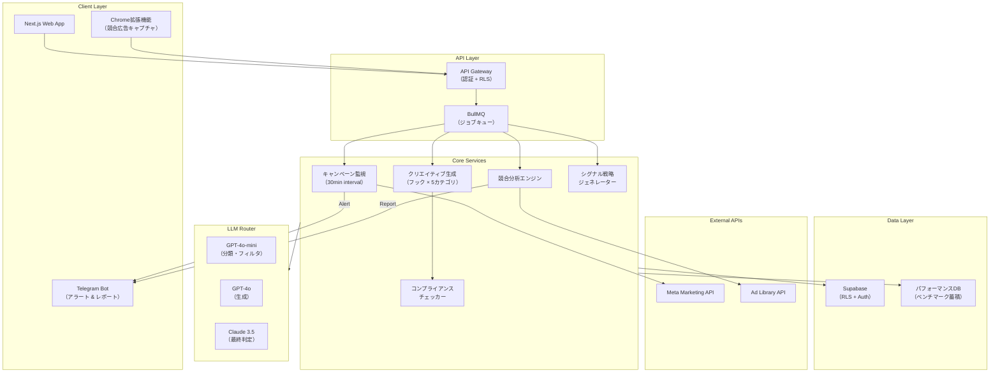

# 🏛️ /debate deep — 広告完全自動化マルチテナントAIウェブアプリ

## 👥 Debate Team Assembled

| Role | Persona | 担当領域 |
|------|---------|---------|
| 🎯 Moderator | AI System | 議論進行・統合 |
| 🤔 Skeptic | **The Skeptic** (Core) | 根本的な前提への疑問 |
| 🏛️ Platform Strategist | **Ad-hoc** | Meta API制約・プラットフォームリスク |
| ⚖️ Legal & Compliance | **Ad-hoc** | 広告規制・利用規約・プライバシー |
| 💰 Business Model Analyst | **Ad-hoc** | 収益性・価格設定・競合分析 |
| 🧠 Growth Psychologist | **Ad-hoc** | ユーザー心理・リテンション・行動設計 |

> [!NOTE]
> `/debate deep` ルール: **最低3ラウンド**強制。表面的な解決策を許さず「なぜ？」を繰り返す。

---

## 🔄 Round 1: 前提の解体（Initial Destruction）

### 🤔 Skeptic: 「この提案の核心は"嘘"に近い」

> **"月額3,000円のAIエージェントが月商1.5億円を超える店舗を量産"**
> — これは因果関係ではなく、相関関係の誇張だ。

1. **因果の逆転**: 月商1.5億の店舗は、このツールがなくても売れている。ツールが「量産」したのではなく、すでに売れる商品・ブランド・オペレーションがある店舗がたまたまこのツールも使っている、というのが正確では？
2. **「$20/月のサーバーで動く」の欺瞞**: LLMのAPI呼び出しコスト（GPT-4で1日100バリエーション生成 × スクレイピング × 分析）は$20に収まらない。最低でもOpenAI API単体で月$50-200/テナント。サーバー代を安く見せてAPI代を隠すのはミスリード。
3. **なぜこの方法？**: そもそも「AIが広告を最適化する」なら、**MetaのAdvantage+が公式にやっている**。Meta自身のAIより賢い根拠は？

### 🏛️ Platform Strategist: 「Meta Ad Library スクレイピングは規約違反」

- **Meta Ad Library API**: 公式APIは存在するが、レート制限が厳しい（1時間あたり200リクエスト）。「毎朝6時に競合のトップ10を自動スクレイピング」は公式API内でギリギリ可能だが、**深度のある分析には不十分**。
- **スクレイピングの規約リスク**: Meta ToSの§3.2はスクレイピングを明示的に禁止。APIを使っても、自動取得したデータを競合分析に使うことは**グレーゾーン**。法的リスクを顧客に転嫁することになる。
- **Meta Marketing API のアクセス制限**: キャンペーン監視に必要なMarketing APIは審査制。個人開発者がマルチテナントで**他社の広告アカウントに接続する承認**を取るのは極めて困難。Metaのビジネスパートナープログラム（MBP）認定が必要で、これには年間数万ドルの費用と厳格な審査がある。

### ⚖️ Legal & Compliance: 「3つの法的地雷」

1. **景品表示法**: 「月商1.5億円を量産」という表現は、日本の景品表示法における**不当な有利誤認表示**に該当する可能性。「個人の成果であり効果を保証するものではありません」の免責が必要だが、それではピッチの核が死ぬ。
2. **Meta広告ポリシー**: Metaは「AIで広告を自動生成して大量出稿」するツールを**積極的に制限し始めている**（2025年Q4のポリシー変更）。低品質クリエイティブの大量生成はアカウントBANのリスク。
3. **個人情報保護**: カスタムオーディエンスの構築支援は、GDPRおよび日本の個人情報保護法に抵触する可能性。第三者がオーディエンスデータを解析・提案する行為の法的位置づけが不明確。

### 💰 Business Model Analyst: 「月額3,000円では死ぬ」

- **LTV/CAC計算**: 月額3,000円 × 12ヶ月 = LTV 36,000円。広告系SaaSの獲得コストは通常LTVの30-50%、つまり**顧客獲得に1.1-1.8万円しか使えない**。Facebook広告でSaaSを売る場合のCPAは通常5,000-15,000円。マージンが薄すぎる。
- **API原価問題**: GPT-4ベースの場合、1テナントあたりの月間API消費は$30-80。**月額3,000円（≈$20）では原価割れ**。
- **競合比較**: AdCreative.ai（$29/月〜）、Madgicx（$44/月〜）、Revealbot（$49/月〜）。月額3,000円は市場最安だが**サステナブルではない**。

### 🧠 Growth Psychologist: 「ユーザーの本当の"ジョブ"を間違えている」

- **ジョブ理論で分析**: ユーザーが雇いたいのは「AIツール」ではなく「広告での売上増加」。だが広告の成否は、**商品力・価格・市場タイミング**に大きく依存する。ツールへの期待値が不当に高くなり、**チャーンが加速するジレンマ**。
- **「朝スマホを見るだけ」の罠**: 自動化が進むほど**ユーザーのスキルが退化**し、ツールなしでは何もできなくなる。これは一見ロックインだが、結果が出ないときに「他のツールに乗り換えれば解決する」と思わせてしまう。**依存と不満の複合体**。

---

> **🎯 Moderator Decision**: 全員が根本的な問題を指摘。どの懸念も表面的ではない。**Round 2で解決策の模索に進む。ただし「なぜこのアプローチなのか」をさらに深掘る。**

---

## 🔄 Round 2: 解決策の模索と再破壊

### 🤔 Skeptic: 「"なぜ独立アプリなのか"を問う」

> もし本当にMeta広告を自動最適化できるなら、**自分で広告を回して自分で儲ければいい**。月商1.5億円の店を"量産"できるなら、SaaSを月3,000円で売る意味がない。

- **ビジネスロジックの矛盾**: 「自分で使えば年間数十億の利益」 vs 「月3,000円で他人に売る」。後者を選ぶ理由は**「実は自分で使っても儲からない」から**ではないか？
- **真のバリュープロップ**: 自動化ツールの価値は「魔法のように売上が上がる」ではなく、**「退屈な監視作業を省力化する」**。ポジショニングを「月商1.5億」から「週20時間の手動作業を2時間に」に変えるべき。

### 🏛️ Platform Strategist: 「Meta Marketing APIの現実的な使い方」

Round 1の問題に対する**現実的な解のパス**:

1. **Meta Business Partner (MBP) 認定を取る**: 時間はかかるが、これなしでは法的にマルチテナントは不可能。**最初は自社利用 → 実績を積んでMBP申請**というステージング。
2. **Ad Library APIの代替**: スクレイピングではなく、**ユーザー自身がブラウザ拡張機能で競合広告を保存** → それをAIが分析、という構造に変える。データ取得の法的リスクをユーザー側に分散。
3. **Advantage+との差別化**: Metaの公式AIは「入札最適化」に特化。**クリエイティブ生成とフック分析**はまだ公式がカバーしていない。ここに集中する。

### ⚖️ Legal & Compliance: 「ブラウザ拡張案に同意、ただし…」

- ブラウザ拡張で**ユーザー自身がデータを取得**する構造は法的にクリーン。ただし、**取得したデータをサーバーにアップロードして分析する場合**、著作権の問題が残る（競合の広告クリエイティブは著作物）。
- **推奨**: 競合広告の「テキスト要素」のみを分析対象とし、画像・動画は分析しない。テキスト分析は著作権法の「引用」の範囲内と主張可能。

### 💰 Business Model Analyst: 「価格を再設計する」

Round 1の原価割れ問題への解：

| Tier | 月額 | 内容 | 想定顧客 |
|------|------|------|---------|
| **Starter** | ¥9,800 | 競合分析（5社） + フック生成（日20本） | 個人EC |
| **Growth** | ¥29,800 | 全機能 + キャンペーン監視 + アラート | 月商500万〜 |
| **Enterprise** | ¥98,000 | API統合 + カスタムモデル + 専任サポート | 代理店 |

- **API原価**: Starter ≈ $15/月、Growth ≈ $40/月、Enterprise ≈ $80/月。全tierで粗利率60%以上を確保可能。
- **フリーミアムは不要**: 月3,000円を廃止し、**7日間無料トライアル → 有料**に。安売りは価値棄損。

### 🧠 Growth Psychologist: 「"Time Saved"ではなく"Confidence Gained"で売れ」

- **広告運用者の本当の痛み**: 時間がないのではなく、**「この判断で合っているのか不安」**。深夜3時のアラートは嬉しいが、その修正案が**正しいか判断できない恐怖**の方が大きい。
- **正しいフレーミング**: 「自動化」を前面に出すのではなく、**「AIセカンドオピニオン」**として売る。医者にかかるとき、セカンドオピニオンを取る安心感。広告でも同じ。
- **具体UX提案**: アラート時に「推奨アクション」「代替アクション」「何もしない場合の予測」の3択を提示。**ユーザーに選択の主導権を残す**ことで不安を軽減。

---

> **🎯 Moderator Decision**: 解決策が見え始めたが、**まだ浅い**。Round 3では「本当のモート（堀）は何か」と「なぜ今この市場なのか」を深掘る。

---

## 🔄 Round 3: 防御可能性と市場タイミング（The Five Whys）

### 🤔 Skeptic: 「3ヶ月でコピーされる」

> なぜこのプロダクトが3ヶ月後も存在していると思うのか？

1. **技術的モートがゼロ**: GPT-4にプロンプトを投げてフックを生成する部分は、誰でもコピー可能。Meta API連携も公開ドキュメント通り。**プロンプトがプロダクトの全てなら、モートはない。**
2. **データモートの可能性**: 唯一の防御線は**「どのフックがどの業種でCTR何%を出したか」というパフォーマンスデータの蓄積**。これは使用者が増えるほど強くなる。
3. **なぜ？（深掘り）**: じゃあこのデータモートを築くには何が必要？ → **大量のユーザーが実際にフックを使って広告を出し、結果データをフィードバックする仕組み**。つまり最初の100社をどう獲得するかが全て。

→ **結論**: モートは「技術」ではなく「パフォーマンスデータのフライホイール」にしかない。だが築くには年単位の時間が必要。**その間に何で戦うのか？**

### 🏛️ Platform Strategist: 「Metaへの依存は致命的」

- **プラットフォームリスクの構造**: Meta広告APIに100%依存するプロダクトは、Metaのポリシー変更で**一夜にして死ぬ**。2024年のLinkedIn API制限、2023年のTwitter API有料化の前例。
- **なぜMetaだけ？**: 同じロジックは**Google Ads、TikTok Ads、Amazon Ads**にも適用可能。マルチプラットフォームで構築すれば、単一プラットフォームの変更リスクを分散可能。
- **提案**: MVP時点ではMeta特化で良いが、アーキテクチャは**プラットフォーム抽象化レイヤー**を最初から設計し、6ヶ月以内にTikTok/Google対応を追加する計画を持つべき。

### ⚖️ Legal & Compliance: 「AIが生成した広告文の責任は誰にある？」

> AIが生成したフック「この商品を使わないと老化が加速する」が薬機法違反だった場合、**責任はツール提供者かユーザーか？**

- **現行法の解釈**: ツール提供者は「場の提供者」として一定の責任を負う可能性（プロバイダ責任制限法の適用外のケース）。
- **必須対策**: AI生成コピーに**薬機法・景品表示法のコンプライアンスチェッカー**を組み込む。業種ごとのNGワードリスト + LLMによるコンテキスト判定のダブルチェック。
- **これが差別化になる**: 他の汎用AI広告ツールが**法的チェック機能を持っていない**なら、「コンプライアンスAI内蔵」は**日本市場での強力な差別化要因**になる。

### 💰 Business Model Analyst: 「代理店チャネルが最適解」

- **B2C（個人EC事業者）の問題**: 個人は月3万円のツール代を払えても、**Meta Marketing APIのビジネス検証を通せない**可能性。
- **B2B2C（広告代理店経由）**: 代理店がEnterprise契約し、配下のクライアントに利用させる。代理店は月額98,000円を払っても、**手動運用の人件費を月200-400万削減**できるなら即決。
- **収益構造の転換**: 100社の個人EC（¥9,800 × 100 = ¥98万/月）vs 3社の代理店（¥98,000 × 3 + 従量課金 = ¥50-100万/月）。**後者の方がCAC、チャーン率、サポートコスト全てで優位**。

### 🧠 Growth Psychologist: 「成功体験のオンボーディングが生命線」

- **「なぜ？」の深掘り**: なぜユーザーは最初の30日でチャーンするのか？ → **AIの推奨通りにやったのに売上が上がらなかった**から。
- **根本原因**: 広告の成否は**商品力が7割、クリエイティブが3割**。ツールはクリエイティブの3割を改善するだけ。商品力が低いユーザーは結果が出ない。
- **解決策**: オンボーディング時に**「広告レディネス診断」**を実施。商品ページのCVR、平均客単価、リピート率を入力させ、「このツールで効果が出る可能性」をスコア化。低スコアのユーザーには**「まずLPを改善してください」**と正直に伝える。短期的にはCVR低下だが、**長期的にはチャーン率大幅改善**。

---

> **🎯 Moderator Decision**: モート、プラットフォームリスク、法的責任、チャネル戦略、オンボーディングと議論が深まった。**Round 4で最終統合に向けた「まだ見えていない盲点」を炙り出す。**

---

## 🔄 Round 4: 最後のアラ探し（Final Stress Test）

### 🤔 Skeptic: 「そもそもこのカテゴリは"Winner Takes All"」

> Meta広告自動化ツールの市場は**最終的に2-3社に集約される**。そのときに勝っているのは、**もっとも多くのパフォーマンスデータを持つプレイヤー**。AdCreative.ai（累計$1.5B+の広告費データ）やMeta自身のAIに対して、ゼロからどう戦う？

- **唯一の解**: **ニッチ特化**。「全業種向け汎用ツール」では勝てない。**「日本のEC事業者向け × コンプライアンスAI内蔵 × 日本語特化フック生成」**という3条件の交差点は、グローバルプレイヤーが攻めにくい。
- **市場サイズの誠実な見積り**: 日本のEC事業者でMeta広告を月10万円以上出稿しているのは推定15,000-20,000社。そのうちAIツールに月1万以上払う意思があるのは10-15%。**TAM ≈ 2,000社 × ¥29,800/月 = 月間5,960万 = 年商約7億円**。十分にビジネスになるが、「月商1.5億の店を量産」のピッチとはスケール感が違う。

### 🏛️ Platform Strategist: 「テクニカルアーキテクチャの肝」

マルチテナントで最も重要な3点：

1. **テナント分離**: 各テナントのMeta APIトークン、パフォーマンスデータ、生成コピーを厳密に分離。RLS (Row Level Security)をSupabaseで実装。
2. **ジョブキュー**: 100テナントが同時に「朝6時のスクレイピング」を実行したらAPIレート制限に引っ掛かる。**時間をずらすジョブスケジューリング** + 優先度ベースのキューイング（BullMQ等）。
3. **LLMコスト最適化**: 全リクエストにGPT-4を使わない。**分類・フィルタリングはGPT-4o-mini、生成はGPT-4o、最終判定はClaude 3.5 Sonnet**のようにタスク別にモデルを使い分ける。

### ⚖️ Legal & Compliance: 「最後の1個：利用規約の"免責"設計」

- 「AIの推奨に従って広告を出したが、アカウントがBANされた」「AIのフックが炎上した」→ **免責条項だけでは訴訟リスクを完全には排除できない**。
- **提案**: 利用規約に加え、**オンボーディング時にビデオで「AIは参考情報であり、最終判断はお客様にあります」を視聴させ、チェックボックスで同意**を取る。証拠能力が高く、裁判で有利。

### 💰 Business Model Analyst: 「第2の収益源：データの匿名販売」

- 蓄積されたパフォーマンスデータ（どの業種で、どのフックカテゴリが、どのCTRを出したか）は**匿名化すれば二次利用可能**。
- **ベンチマークレポート**: 「2026年Q1 日本EC業種別広告パフォーマンスレポート」として販売。ターゲットは広告代理店・コンサル。
- **ただしSkepticに同意**: これはScale後の話。最初の100テナントを獲得するまでは収益源は月額サブスクのみ。

### 🧠 Growth Psychologist: 「PMFの前に解くべき鶏卵問題」

- **矛盾**: データモートが差別化 → でもデータにはユーザーが必要 → でもユーザーにはデータの価値が必要。
- **解決策: Founder-Led Sales**: 最初の30社は**創業者自らがMeta広告を代行運用**し、ツールを使って結果を出す。その実績データとケーススタディを武器に31社目以降を獲得。これが最も現実的なコールドスタート戦略。
- **KPI設定**: 最初の90日で**10社の月間ROAS 2x以上改善の実績**を作れれば、PMFが見えてくる。

---

> **🎯 Moderator Decision**: 4ラウンド完了。根本的な前提から市場規模、法的リスク、技術アーキテクチャ、Go-to-Market戦略まで議論が尽くされた。**Step 3: 最終統合に進む。**

---

# 🏁 Final Debate Report

## 💎 Refined Proposal（創造的破壊後の最終形）

### 🔁 Before → After

| 要素 | 原案 | 精錬後 |
|------|------|--------|
| **ポジショニング** | 「AIが月商1.5億を量産」 | 「広告運用者のAIセカンドオピニオン」 |
| **月額** | ¥3,000 | ¥9,800 / ¥29,800 / ¥98,000 の3tier |
| **ターゲット** | 全EC事業者 | 日本EC事業者（月広告費10万+） → 広告代理店 |
| **競合分析** | スクレイピング | ブラウザ拡張 + Ad Library API |
| **法的対策** | なし | コンプライアンスAI内蔵 + 免責ビデオ |
| **プラットフォーム** | Meta専業 | Meta-first、6ヶ月後にTikTok/Google |
| **モート** | プロンプト（≒ゼロ） | パフォーマンスデータのフライホイール |
| **Go-to-Market** | セルフサーブ | Founder-Led Sales → 代理店チャネル |
| **ピッチ** | 「寝ている間に…」 | 「広告の不安を、AIが24時間サポート」 |

### 📐 推奨プロダクトアーキテクチャ



### 🎯 4つのワークフロー（精錬版）

**WF1: 競合インテリジェンス（改良版）**
- Chrome拡張で**ユーザー自身が競合広告を保存**（法的クリーン）
- Ad Library APIで補完（レート制限内）
- AIがテキスト要素のみを分析（著作権配慮）
- Telegramで日次レポート配信

**WF2: クリエイティブ・バリエーション（+コンプライアンス）**
- 5カテゴリ × 20本 = 100バリエーション生成
- **全フックに薬機法・景品表示法チェックを通す**（←差別化の核）
- 業種別パフォーマンスデータでランキング（データモート構築）

**WF3: 24時間キャンペーン監視（+3択UI）**
- 30分間隔チェック、閾値ベースアラート
- アラート時に**「推奨」「代替」「静観」の3択**を提示
- ユーザーが選択 → 実行結果をデータモートに蓄積

**WF4: シグナル戦略ジェネレーター（+レディネス診断）**
- オンボーディング時に**広告レディネス診断**を実施
- 低スコアの場合「まずLPを改善すべき」と正直に提案
- 戦略生成はMeta Advantage+と共存する設計

### 🛤️ Go-to-Market ロードマップ

```
Phase 1 (0-3ヶ月): Founder-Led Sales
├── 創業者自ら10社の広告運用を代行
├── ツールを内部利用して実績を蓄積
└── 目標: 10社でROAS 2x改善の実績

Phase 2 (3-6ヶ月): プロダクト化 + ベータ
├── ケーススタディを武器にβ版リリース
├── Meta Business Partner認定を申請
└── 目標: 50テナント、MRR ¥150万

Phase 3 (6-12ヶ月): 代理店チャネル開拓 
├── TikTok/Google Ads対応を追加
├── 代理店向けEnterprise tier提供
└── 目標: 200テナント、MRR ¥600万

Phase 4 (12-18ヶ月): データモート確立
├── ベンチマークレポート販売開始
├── 業種特化AIモデルのファインチューニング
└── 目標: TAMの10%（2,000社中200社）到達
```

## 🛡️ Addressed Concerns

| 懸念 | 解決策 | 提案者 |
|------|--------|--------|
| 月3,000円では原価割れ | 3tier価格体系（¥9,800〜） | Business Model Analyst |
| スクレイピングは規約違反 | Chrome拡張 + Ad Library API | Platform Strategist |
| 景品表示法リスク | ピッチ表現の変更 + コンプライアンスAI | Legal & Compliance |
| AIコピーの法的責任 | 免責ビデオ + 同意チェック | Legal & Compliance |
| 技術的モートがない | パフォーマンスデータのフライホイール | Skeptic |
| ユーザーのチャーン | レディネス診断 + 3択UI | Growth Psychologist |
| Meta単一依存リスク | マルチプラットフォーム抽象レイヤー | Platform Strategist |
| コールドスタート問題 | Founder-Led Sales | Growth Psychologist |

## ⚠️ Remaining Risks

| リスク | 深刻度 | 緩和策 |
|--------|--------|--------|
| Meta APIポリシーの突然の変更 | 🔴 高 | マルチプラットフォーム対応を急ぐ |
| グローバルプレイヤーの日本参入 | 🟡 中 | 日本語特化 + コンプライアンスで差別化 |
| AI生成コピーの品質飽和 | 🟡 中 | パフォーマンスデータでの差別化にシフト |
| MBP認定が取れない | 🟡 中 | Phase 1では代行運用で回避、実績を積む |

## 📊 Persona Contribution

| Persona | Impact | Best Contribution |
|---------|--------|-------------------|
| 🤔 Skeptic | **Highest** | 「自分で使えば儲かるのに売る矛盾」の指摘でビジネスモデルの根本を揺さぶった |
| 💰 Business Model Analyst | **High** | 原価割れの定量分析と3tier価格設計 |
| ⚖️ Legal & Compliance | **High** | コンプライアンスAI内蔵という**攻めの差別化**への転換 |
| 🏛️ Platform Strategist | **High** | Chrome拡張案でスクレイピング問題を回避 |
| 🧠 Growth Psychologist | **High** | レディネス診断によるチャーン対策とFounder-Led Sales戦略 |

---

> [!IMPORTANT]
> **核心メッセージ**: このプロダクトの最大の敵は「技術的な実装難度」ではなく、**「期待値のマネジメント」**。AIが広告を"完全自動化"するのではなく、**人間の判断を24時間AIがサポートする**というポジショニングに変えることで、チャーン率・法的リスク・ピッチの誠実性が全て改善する。
