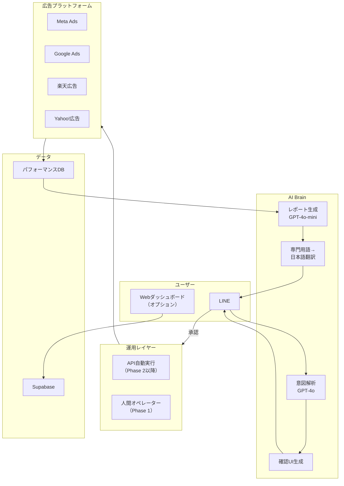

# 🏛️ /debate deep v2 — 広告設定全自動化＋直感GUI＋AI分析ツール

> **提案**: Meta/Google広告は多機能すぎてややこしい。設定を全自動化し、成果をわかりやすいGUIで表示、数字の分析と改善提案が出てくるツール。

---

## 👥 Debate Team Assembled

| Role | Persona | 担当 |
|------|---------|------|
| 🎯 Moderator | AI System | 議論進行 |
| 🤔 Skeptic | Core | 前提への疑問 |
| 🏛️ Platform Strategist | Ad-hoc | Meta/Google API制約・認定要件 |
| 🎨 UX Architect | Ad-hoc | GUI設計・ユーザー体験 |
| 💰 Market Analyst | Ad-hoc | 競合・価格・市場サイズ |
| 🔧 Technical Realist | Ad-hoc | 実装難度・「全自動」の技術的定義 |
| 📈 Ad Operations Veteran | Ad-hoc | 現場の広告運用者の実態 |

---

## 🔄 Round 1: 「全自動」の定義を壊す

### 🤔 Skeptic: 「"全自動設定"は物理的に不可能」

> 広告の「設定」には何が含まれるか、具体的に分解しよう。

| 設定項目 | 自動化可能？ | 理由 |
|---------|-------------|------|
| キャンペーン目的の選択 | ❌ | 「認知」「トラフィック」「コンバージョン」のどれかはビジネス判断 |
| 予算設定 | ❌ | いくら使うかはユーザーの懐事情 |
| ターゲットオーディエンス | ⚠️ 半自動 | AI提案はできるが、最終判断は人間 |
| 広告クリエイティブ（画像/動画） | ⚠️ 半自動 | 素材がなければ生成できない |
| 広告コピー | ✅ | AI生成可能 |
| 配信スケジュール | ⚠️ 半自動 | デフォルト提案は自動、カスタムは人間 |
| 入札戦略 | ✅ | Meta/Google側がほぼ自動化済み |
| コンバージョン計測設定 | ❌ | ピクセル/GTM設置は技術作業 |
| 支払い情報 | ❌ | クレカ登録は人間のみ |

**結論**: 「全自動」と言えるのは全体の**30%程度**。残り70%は「ガイド付き半自動」が正確。**「全自動」と謳って実態が半自動だと、ユーザーの怒りを買う。**

なぜこの定義が重要か？→ 期待値のズレがチャーンの最大原因だから。前回のディベートと同じ罠。

### 🏛️ Platform Strategist: 「MetaとGoogleで"全自動"の意味が違う」

- **Meta Ads**: Advantage+ Shopping Campaign（ASC）がほぼ全自動。ターゲティング・配置・入札を全部Meta側AIが処理。**Metaが公式に「全自動」をすでに提供している**。このツールの存在意義は？
- **Google Ads**: Performance Max（P-Max）が同じコンセプト。素材を入れるだけでGoogle AIが最適化。**これも公式に全自動**。
- **残る「自動化の余地」**: プラットフォーム公式AIがカバーしないのは**①初期セットアップのウィザード化 ②複数プラットフォームの横断管理 ③結果の人間向け翻訳**。ここが本当の価値。

### 🎨 UX Architect: 「"わかりやすいGUI"こそ最大の差別化候補」

- **MetaのAds Manager**: 100以上のメトリクスが並ぶテーブルビュー。広告初心者は何を見るべきかわからない。
- **Google Ads管理画面**: さらに複雑。キャンペーン→広告グループ→広告→キーワードの階層構造が直感的でない。
- **もしGUIだけを切り出すなら**: 「MetaとGoogleの管理画面を捨てて、"信号機ダッシュボード"にする」という価値命題が成り立つ。🟢=好調、🟡=注意、🔴=要対応。**数字を読めない人でも一瞬で状態がわかる。**

### 💰 Market Analyst: 「このカテゴリは超デッドゾーン」

| 競合 | 月額 | 調達額 | 特徴 |
|------|------|--------|------|
| **AdEspresso** (Hootsuite) | $49〜 | 買収済み | Meta広告の簡易化ダッシュボード |
| **Smartly.io** | Enterprise | $200M+ | クリエイティブ最適化 + 自動化 |
| **Revealbot** | $49〜 | Self-funded | ルールベース自動化 |
| **Adzooma** | 無料〜 | £13M | Google/Meta/Microsoft統合ダッシュボード |
| **Madgicx** | $44〜 | $30M+ | AI最適化 + クリエイティブ |
| **WordStream** | $49〜 | 買収済み | SMB向け簡易管理 |

**6社以上が同じ「広告を簡単にする」ポジション**を取っている。しかも全社が2018-2022年に参入し、すでに数年の実績とデータモートを持つ。

→ **なぜ2026年に新規参入して勝てるのか？** この問いに答えられなければ死ぬ。

### 🔧 Technical Realist: 「"全自動設定"に必要なAPI権限の現実」

Meta/Google両方で広告を「代わりに作成・管理」するには：

1. **Meta**: Marketing API + Business Manager接続 + **MBP認定**（前回と同じ障壁）
2. **Google**: Google Ads API + Developer Token（**Basic Accessは月15,000オペレーション制限、Standard Accessは申請制**）
3. **支払い代行**: ユーザーの広告費をこちらが立て替える場合は**資金移動業者の登録**が必要（日本の場合）
4. **権限委任モデル**: ユーザーが自分のMeta/Googleアカウントを接続 → OAuthトークンで代理操作。これが最も現実的だが、**セキュリティとプライバシーの懸念がユーザー側にある**。

### 📈 Ad Operations Veteran: 「現場の声は"分析がほしい"じゃない」

> 10年間中小企業の広告運用をやってきた立場から言わせてもらうと——

- **中小EC事業者が本当に困っていること**: 「分析」じゃない。**「何をすればいいか」の一言**がほしい。数字を見せられても行動に繋がらない。
- **理想のUX**: ダッシュボードを開いたら**今日やるべきこと1つだけ**が表示される。「広告Aの画像を変えてください。理由：3日間CTRが低下しています。提案画像はこちら。」
- **既存ツールが失敗した理由**: どれも「もっとデータを見せる」方向に進化した。だが**データが増えるほどユーザーは混乱する**。必要なのは「データを減らす」こと。

---

> **🎯 Moderator Decision**: 「全自動」の定義が崩壊し、競合の飽和が明らかになった。だがUX ArchitectとAd Ops Veteranの指摘に**面白い交差点**がある。Round 2で「データを減らす」方向を深掘る。

---

## 🔄 Round 2: 「Less is More」の方向転換

### 🤔 Skeptic: 「"広告を簡単にする"ツールはなぜ全部中途半端なのか？」

> **なぜ？（1段目）**: AdEspresso, Adzooma, WordStreamが全部$49で止まっている
> **なぜ？（2段目）**: 簡易化しても結局MetaとGoogleの管理画面を使う必要がある
> **なぜ？（3段目）**: ツールが「上に被せるレイヤー」であって「置き換え」ではないから
> **なぜ？（4段目）**: 置き換えにするとAPIの制約で結局同じ複雑さが必要になるから
> **なぜ？（5段目）**: **広告プラットフォームの複雑さはビジネスの複雑さの反映**であり、UIを変えても本質は変わらないから

→ **根本洞察**: 広告の「設定」を簡単にしようとする限りは、先行者の後追い。**設定を完全にスキップしてしまう**のが唯一の突破口。

### 🎨 UX Architect: 「チャットUI一択」

Skepticの洞察を受けて——GUIダッシュボードを作ること自体が罠。

**提案: 全操作をチャット/音声で完結させる**

```
ユーザー: 「予算5万円で、30代女性にこのスキンケア商品の広告出して」
AI: 「了解。MetaとGoogleに以下のキャンペーンを作成しました：
      ・Meta: ASC、予算3万円、30-39歳女性、コンバージョン目的
      ・Google: P-Max、予算2万円、美容系キーワード
      2日後に結果レポートをお送りします。」

（2日後）
AI: 「🟢 Metaの方がCPA 40%低いです。予算をMeta4万/Google1万に変更しますか？」
ユーザー: 「OK」
AI: 「変更しました。次のレポートは3日後です。」
```

- **ダッシュボードは存在しない**。見たい人だけ「詳細を見せて」と言えば数字が出る。
- **デフォルトは「結果だけ通知」**。
- **Telegram/LINE/WhatsApp上で動く** → 専用アプリのインストール不要。

### 📈 Ad Operations Veteran: 「これは"代理店のAI版"だ」

> UX Architectの提案に強く賛同。なぜなら中小事業者は今まさに**「月5万で広告回してくれる人」を探している**から。

- **現状**: 広告代理店に頼むと最低月額10-30万円 + 広告費の20%マージン。
- **このツール**: 月額1-3万円で「AIに話しかけるだけ」の広告代理店体験。
- **本質**: 「広告ツール」ではなく**「AI広告代理店」**。ツール市場ではなく**代理店市場を食う**。

**代理店市場の規模**: 日本のインターネット広告代理店市場は約3.5兆円（2025年）。中小向け（月予算5-50万円）セグメントは推定3,000-5,000億円。このうち1%を取るだけで30-50億円。

### 💰 Market Analyst: 「これなら競合構造が変わる」

ピボット後の競合マップ:

| カテゴリ | 具体例 | 本ツールとの差 |
|---------|--------|---------------|
| 従来型ツール | AdEspresso, Revealbot | UIを被せるだけ。設定はユーザー |
| AI広告ツール | AdCreative.ai, Madgicx | クリエイティブ特化。広告管理は結局手動 |
| **フルサービスAI代理店** | **本ツール** | **設定もチャットも分析も全部含む** |
| 人間の代理店 | 電通デジタル, オプト等 | 高品質だが月30万〜 |
| 簡易広告サービス | Meta Boost, Google Smart Campaign | 無料だが最適化がほぼない |

→ **「AI代理店」というポジションは空白地帯**。人間の代理店と無料の公式ツールの間のギャップを埋める。

### 🔧 Technical Realist: 「チャットUIなら技術的に何が変わるか」

**良い点**:
- GUI開発コストが大幅減。フロントエンドはTelegram Bot / LINE Bot / シンプルWebチャット。
- 複雑なダッシュボードを作る必要なし → **MVPが2-3ヶ月で可能**。

**変わらない問題**:
- Meta Marketing API / Google Ads APIの認定要件は同じ。
- ユーザーのアカウントにOAuth接続する必要は同じ。

**新しい問題**:
- チャットでの「意図理解」が高精度でないと致命的。「30代女性にスキンケアの広告」→ 実際のAPI パラメータへの変換ミスが怖い。
- **確認ステップ**: 実行前に「この設定で出稿しますか？」の確認を必ず挟む。お金がかかる操作を誤発射できない。

### 🏛️ Platform Strategist: 「MBP問題の回避策が見えた」

チャットUI + AI代理店モデルなら：

- **Phase 1: 手動ブリッジ**: ユーザーのチャット指示をAIが解釈 → **人間オペレーターが代理設定**（ただしAIアシスト）。MBP不要。
- **Phase 2: 半自動化**: MBP認定取得後、設定の80%をAPI経由で自動化。
- **Phase 3: 全自動化**: 全操作をAPI経由に。人間オペレーター不要。

**これが「ウィザード・オブ・オズ」MVP**。裏側が人間でもユーザーには関係ない。MBP取得を待たずにローンチできる。

---

> **🎯 Moderator Decision**: ピボットの方向が固まった。Round 3では**このモデルの弱点を徹底的に叩く**。

---

## 🔄 Round 3: AI代理店モデルの破壊テスト

### 🤔 Skeptic: 「"AI代理店"を名乗る法的リスク」

> 日本で「広告代理店」を名乗るには何が必要か？

1. **広告代理店業は許認可不要**（日本では自由業）→ 法的にはOK。
2. **ただし「広告運用代行」でお金を受け取る場合**、広告費の立替が発生すると**資金移動のリスク**。
3. **解決策**: ユーザー自身のクレカでMeta/Googleに直接支払い。ツールは「管理サービス」としてサブスク料のみ受領。広告費には一切触れない。

→ これはクリア。だが**次の「なぜ」**:

> なぜユーザーはAIを「代理店」として信頼するのか？

- 人間の代理店→担当者の顔が見える→信頼。
- AIチャット→ブラックボックス→不安。
- **解決策**: 初回に**人間のオンボーディングコール（15分）**を入れる。その後はAIが対応。ハイブリッドモデル。

### 📈 Ad Operations Veteran: 「月予算5万円以下の顧客は地獄」

> 代理店が中小を避ける理由は**採算が合わない**から。月予算5万円の顧客は：

1. 広告費が少なすぎてAIの学習データが集まらない → 最適化が効かない
2. 1件のコンバージョンの価値が高すぎて**1件も取れないと「詐欺だ」と言い出す**
3. サポート要求が最も多い（リテラシーが低いほど質問が多い）

→ **最低月予算を10-15万円に設定すべき**。それ以下はGoogle Smart CampaignやMeta Boostで十分。

### 💰 Market Analyst: 「単価を上げる正当な理由がある」

AI代理店として売るなら：

| 比較対象 | 月額 | ユーザーの作業 |
|---------|------|--------------|
| 人間の代理店 | ¥100,000-300,000 + 広告費20% | ほぼゼロ |
| **本ツール** | **¥29,800-49,800** | チャットで指示するだけ |
| 既存ツール | ¥5,000-15,000 | 自分で全部やる |

**¥29,800-49,800は「代理店比で1/3以下」として正当化可能**。既存ツール比で高くても、**ユーザーの作業量が圧倒的に少ない**ことで差別化。

**収益モデル**:
- 月額¥39,800 × 500社 = **MRR ¥1,990万** = **ARR 約2.4億円**
- 500社の獲得は日本のEC事業者（月広告費10万+推定15,000-20,000社）の3%。達成可能な数字。

### 🔧 Technical Realist: 「意図理解のエラーレートが鍵」

チャットで「30代女性にスキンケア」→ API設定変換のパイプライン:

```
[ユーザー入力] → [LLM意図解析] → [構造化パラメータ] → [確認表示] → [API実行]
```

- **エラーレート許容値**: 広告はお金がかかる。意図解析の精度は**99%以上**必要。
- **現実のGPT-4oの精度**: 自然言語→構造化データの変換は約95-97%。**残り3-5%が誤設定。**
- **対策**: 実行前に**必ず人間が確認するステップ**を入れる。「以下の設定で出稿します。よろしいですか？」→ Yes/No。
- **これは「全自動」ではない**: 正確には**「全提案 + ワンタップ承認」**。でもユーザー体験としては十分に「簡単」。

### 🎨 UX Architect: 「確認UIの設計が命」

確認ステップのUX:

```
AI: 以下のキャンペーンを作成します 👇

📱 Meta広告
  ├ 目的: 購入
  ├ 予算: ¥30,000/月
  ├ 対象: 30-39歳 女性 美容関心
  └ 形式: Advantage+ Shopping

🔍 Google広告  
  ├ 目的: コンバージョン
  ├ 予算: ¥20,000/月
  └ 形式: Performance Max

[✅ 出稿する] [✏️ 変更する] [❌ やめる]
```

- **3ボタンのみ**。選択肢を増やさない。
- **「変更する」を押した場合**: 「何を変えたいですか？」とチャットで聞く。フォームは使わない。
- **結果レポートも同じ形式**:

```
AI: 📊 先週の結果です

🟢 Meta広告: ¥28,500使用 → 12件購入 (CPA ¥2,375)
🟡 Google広告: ¥19,200使用 → 5件購入 (CPA ¥3,840)

💡 提案: Google予算をMetaに移動すると、
   購入数が+4件/週 増える可能性があります

[✅ 提案を実行] [📊 詳しく見る] [⏭️ 今週はこのまま]
```

---

> **🎯 Moderator Decision**: AI代理店モデルの輪郭がかなりシャープになった。Round 4で**最後のストレステスト**。

---

## 🔄 Round 4: 最終ストレステスト

### 🤔 Skeptic: 「このモデルの本当の競合は"Shopifyの中の人"」

> **見落としている脅威**: Shopify、BASE、STORESなどのECプラットフォームが**広告機能を内蔵し始めている**。

- Shopifyは2024年にShopify Audiencesをリリース。商品データから自動でMeta/Google広告を作成。
- BASEは「BASE Ads」で簡易広告出稿機能を提供。
- **これらはECプラットフォーム内から「ボタン1つ」で広告が出せる**。別ツールにログインする必要すらない。

→ **なぜECプラットフォーム内蔵機能ではなく、別のサービスを使うのか？**

- **回答**: ECプラットフォーム内蔵は「最低限」。予算配分の最適化、クロスプラットフォーム分析、クリエイティブ提案は**やらない**。ここが差別化ポイント。
- **ただし長期リスク**: Shopifyが本気を出したら食われる。**Shopify非対応のプラットフォーム（独自EC、楽天、自社サイト）を初期ターゲットにする**のが安全。

### 🏛️ Platform Strategist: 「Wizard of Oz MVPの実行計画」

Phase 1（MBP不要）の具体的な構造:

```
[ユーザー] → LINE/Telegram → [AIが設定案を生成]
                                      ↓
                              [人間オペレーターが確認]
                                      ↓
                              [ユーザーのMeta/Google画面を
                               画面共有で見ながら代理設定]
```

- **必要人員**: オペレーター1名で**顧客20-30社を管理可能**（1社あたりの設定変更は週1-2回、各5-10分）。
- **月額¥39,800 × 25社 = ¥995,000/月の売上** → オペレーター人件費¥30-40万を引いても**粗利60%**。
- **MBP取得後**: オペレーターの仕事の80%がAPI自動化に置き換わり、1人あたり100社に。

### 📈 Ad Operations Veteran: 「成功指標の"翻訳"が最重要」

> 初心者が「CPA」「ROAS」「CTR」を理解しているわけがない。

**翻訳テーブル**:

| 業界用語 | ユーザーに見せる表現 |
|---------|-------------------|
| CPA ¥2,375 | 「1人のお客さんを連れてくるのに¥2,375かかっています」 |
| ROAS 4.2x | 「広告費の4.2倍の売上が出ています。優秀です 🟢」 |
| CTR 0.8% | 「広告を見た人の0.8%がクリックしています。もう少し改善できます 🟡」 |
| CPM ¥1,200 | （表示しない。ユーザーに不要な情報） |

**原則: 表示する数字は最大3つ**。それ以上は「詳しく見る」ボタンの裏に隠す。

### 💰 Market Analyst: 「日本市場特有のチャンス」

- **日本の広告代理店はDXが遅れている**: 大手は人力運用。中小向けに安価なサービスを提供する余力がない。
- **LINE連携の優位性**: 日本のSMB事業者はLINEでビジネスコミュニケーション。**LINEボットとしてAI代理店を提供**すれば、Telegram/WhatsApp前提の海外ツールより圧倒的にリーチが良い。
- **楽天・Yahoo!ショッピング対応**: 日本のEC事業者はMeta/Googleだけでなく**楽天広告・Yahoo!広告**も使う。ここに対応すれば海外プレイヤーとの差別化が決定的。

### 🔧 Technical Realist: 「MVPのテックスタック」

```
フロントエンド: LINE Bot SDK + Next.js（管理画面最小限）
バックエンド:   Node.js + BullMQ（ジョブキュー）
DB:           Supabase（RLS + Auth）
AI:           GPT-4o（意図解析） + GPT-4o-mini（レポート生成）
通知:          LINE Messaging API
インフラ:      Vercel + Railway（$50/月で開始可能）
```

**MVP開発期間: 6-8週間**（LINE Bot + 意図解析 + 確認UI + 手動設定フロー）

---

> **🎯 Moderator Decision**: 4ラウンド完了。提案は「広告簡単ツール」から**「LINEで話しかけるだけのAI広告代理店」**に根本転換した。最終統合へ。

---

# 🏁 Final Debate Report

## 💎 Refined Proposal: 「LINEで広告。」

### コンセプト

> **「LINEにメッセージを送るだけで、Meta広告もGoogle広告もプロ品質で運用される。ダッシュボードは不要。結果はLINEに届く。」**

### 🔁 Before → After

| 要素 | 原案 | 精錬後 |
|------|------|--------|
| **本質** | 広告設定の簡易化ツール | LINEベースのAI広告代理店 |
| **UI** | GUIダッシュボード | **チャットUI（LINE Bot）** |
| **操作** | 画面で設定 | 自然言語で指示→ワンタップ承認 |
| **結果表示** | メトリクスダッシュボード | **信号機 + 日本語の3行レポート** |
| **専門用語** | CPA, ROAS, CTR | 「1人あたり¥2,375」「広告費の4.2倍の売上」 |
| **MVP** | GUI + API連携 | **Wizard of Oz（裏側に人間オペ）** |
| **月額** | ¥3,000 | **¥39,800**（代理店比1/3以下） |
| **ターゲット** | 全EC事業者 | 月広告費10-50万のEC事業者（楽天含む） |
| **競合** | AdEspresso, Madgicx等 | **人間の広告代理店**（代替対象） |

### 📐 プロダクトアーキテクチャ



### 🛤️ Go-to-Market ロードマップ

```
Phase 1 (0-3ヶ月): Wizard of Oz MVP
├── LINE Bot + 人間オペレーター
├── 最初の10社はFounder-Led Salesで獲得
├── MBP / Google Ads API認定を並行申請
└── 目標: 10社、MRR ¥40万

Phase 2 (3-6ヶ月): 半自動化
├── API連携で設定作業の80%を自動化
├── オペレーター1人あたり50-100社に
├── 楽天/Yahoo!広告対応を追加
└── 目標: 100社、MRR ¥400万

Phase 3 (6-12ヶ月): スケール
├── 完全API自動化（人間介在は例外処理のみ）
├── Webダッシュボード追加（パワーユーザー向け）
├── 代理店向けホワイトラベル提供
└── 目標: 500社、MRR ¥2,000万（ARR 2.4億）

Phase 4 (12-24ヶ月): データモート
├── 業種別ベンチマークデータの販売
├── クリエイティブ自動生成（Videditの技術転用可能）
└── 目標: 1,000社、ARR 5億
```

## 🛡️ Addressed Concerns

| 懸念 | 解決策 | 提案者 |
|------|--------|--------|
| 「全自動」は不可能 | 「全提案 + ワンタップ承認」に再定義 | Skeptic + Technical Realist |
| 競合6社以上 | 「ツール」→「AI代理店」にカテゴリ転換 | Market Analyst |
| MBP未取得で出稿不可 | Phase 1はWizard of Oz（人間代行） | Platform Strategist |
| 専門用語がわからない | 信号機 + 日本語翻訳レイヤー | Ad Ops Veteran |
| GUIダッシュボード開発コスト | LINE Botでダッシュボード不要に | UX Architect |
| Shopifyの内蔵機能 | 楽天/Yahoo!/独自EC対応で差別化 | Skeptic |

## ⚠️ Remaining Risks

| リスク | 深刻度 | 緩和策 |
|--------|--------|--------|
| LINE Bot APIの制限（月間メッセージ数） | 🟡 中 | LINE公式アカウントのプロプラン（月¥15,000で上限緩和） |
| 広告費の誤出稿でユーザーに損害 | 🔴 高 | 必ず確認ステップ + 日次予算上限の自動設定 |
| 人間オペレーターのスケール限界 | 🟡 中 | Phase 2でAPI自動化に移行する前提 |
| 楽天/Yahoo!のAPI対応が不十分 | 🟡 中 | 初期はMeta/Google特化、API成熟を待つ |

## 📊 Persona Contribution

| Persona | Impact | Best Contribution |
|---------|--------|-------------------|
| 🤔 Skeptic | **Highest** | 「Five Whys」で問題の根本をUIからビジネスモデルに転換させた |
| 🎨 UX Architect | **Highest** | チャットUIへのピボットを提案し、プロダクト全体の方向を変えた |
| 📈 Ad Ops Veteran | **High** | 「データを減らす」「1アクションだけ表示」の現場知見 |
| 💰 Market Analyst | **High** | 代理店市場3,000-5,000億のTAM発見 |
| 🏛️ Platform Strategist | **High** | Wizard of Oz MVPでMBP問題を回避する戦術 |
| 🔧 Technical Realist | **Medium** | 意図解析エラー率の定量化と確認ステップの必要性 |

---

> [!IMPORTANT]
> **前回との決定的な違い**: 前回は「ツール市場（AdEspresso等）で勝てるか」で詰んだ。今回は**「代理店市場を食う」**にピボットし、競合構造を完全に変えた。月¥39,800は「ツールとしては高い」が「代理店としては破格」。このフレーミングが全てを変える。

> [!TIP]
> **Videditとのシナジー**: Phase 4でクリエイティブ自動生成を追加する際、Videditの動画生成パイプラインをそのまま転用可能。広告用ショート動画の自動量産は非常に親和性が高い。
