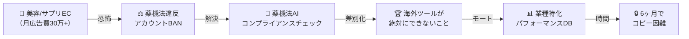

# 🏛️ /debate deep v3 — 1人で勝ち確パターンを見つけろ

> **制約**: 使えるのは1人だけ。技術もオペレーションも1人。
> **目標**: 「勝ち確」と言えるまで掘り下げる。

---

## 👥 Debate Team Assembled

| Role | Persona | 担当 |
|------|---------|------|
| 🎯 Moderator | AI System | 議論進行 |
| 🤔 Skeptic | Core | 前提をぶっ壊す |
| 🎖️ Solo Founder Veteran | Ad-hoc | 1人創業のリアル |
| 💰 Unit Economics Analyst | Ad-hoc | 1人で回る数字の設計 |
| 🧪 Lean Startup Strategist | Ad-hoc | 最速PMF到達戦略 |
| 🧠 Behavioral Designer | Ad-hoc | 顧客獲得の心理設計 |
| ⚡ Automation Architect | Ad-hoc | 1人の限界を技術で突破 |

---

## 🔄 Round 1: 「1人」が意味すること

### 🤔 Skeptic: 「v2の計画は1人では実行不可能」

v2のPhase 1を1人で回すと：

| タスク | 週あたり時間 |
|--------|------------|
| LINE対応（顧客チャット） | 15-20h |
| 広告設定・運用代行 | 10-15h |
| レポート作成・配信 | 5-8h |
| 営業・新規獲得 | 10-15h |
| LINE Bot開発・保守 | 10-15h |
| **合計** | **50-73h/週** |

→ **10社で既に限界突破**。20-30社なんて物理的に不可能。

さらに：
- 深夜にトラブルが起きたら？ → 1人なら対応不能
- 体調崩したら？ → サービス停止
- 開発とオペレーション同時進行 → **両方中途半端に**

> **根本質問**: 1人で「AI代理店」を運営するのは、そもそも構造的に破綻していないか？

### 🎖️ Solo Founder Veteran: 「1人スタートアップの鉄則は"Build一択か、Sell一択か"」

> 10年間ソロファウンダーをやった経験から——**1人では"作りながら売る"は不可能**。

2つの道しかない：

**道A: Build First（作ってから売る）**
- 3ヶ月間、開発だけに集中。顧客ゼロ。
- 完成したプロダクトをProduct Huntやツイートで公開。
- 問題：**3ヶ月間収入ゼロ + 作ったものが外れるリスク**。

**道B: Sell First（売ってから作る）**
- 最初から顧客に「手動で」サービスを提供。
- **お金が入りながら**顧客が本当に何を求めるかを学ぶ。
- 学んだことを基に少しずつ自動化していく。
- 問題：**スケールが遅い。だが死なない**。

→ **1人なら道B一択**。死なないことが最優先。

### 💰 Unit Economics Analyst: 「1人で回る最大顧客数を逆算」

**前提**: 1人の稼働時間 = 週50h（持続可能な上限）

**自動化なしの場合**:

| タスク | 1社あたり/週 | 
|--------|-------------|
| 初期設定 | 2h（初回のみ） |
| 週次の広告調整 | 30min |
| 週次レポート（AI生成→確認→送信） | 15min |
| チャット対応 | 20min |
| **合計** | **65min/社/週** |

50h ÷ 65min = **約46社が理論上限**。

だが営業・管理・開発時間を引くと：
- 営業: 10h/週
- 管理・事務: 5h/週  
- 開発・改善: 10h/週
- **残り: 25h = 1,500min → 約23社が現実上限**

**23社 × ¥49,800 = MRR ¥114万** → **年商約1,370万円**

→ 1人のSaaSとしては悪くない。だが**「勝ち確」とは言えない**。

### 🧪 Lean Startup Strategist: 「仮説検証にかけていい時間は"2週間"」

> 1人のリソースで最も高価なものは**時間**。3ヶ月かけてMVPを作り、外したら致命傷。

**2週間で検証すべき仮説**:
1. 「月10-50万円の広告費を出しているEC事業者は、月¥49,800で広告運用を外注したいか？」
2. 「LINEで指示を出すだけの体験に、¥49,800の価値を感じるか？」
3. 「自分1人で、品質を維持しながら何社捌けるか？」

**検証方法**: コードを1行も書かずに、**LP + LINEアカウント + 手動運用で3社獲得を試みる。2週間で3社取れなければピボット。**

### ⚡ Automation Architect: 「AIで"65min/社/週"を"15min/社/週"にできる」

自動化のレイヤー：

| タスク | 現状 | AI自動化後 |
|--------|------|-----------|
| 広告調整 | 30min（手動でMeta/Google画面操作） | 10min（AIが調整案を生成→ワンクリック承認） |
| レポート | 15min（数値確認→文章作成→送信） | 2min（全自動生成→自動LINE送信） |
| チャット対応 | 20min（返信を考えて入力） | 3min（AIがドラフト→確認→送信） |
| **合計** | **65min** | **15min** |

→ 15min/社なら、25時間で**100社**対応可能。

**ただし現実**:
- この自動化レベルに達するには**3-6ヶ月の開発が必要**。
- Phase 1は手動65min/社で始め、稼ぎながら自動化を進める。

---

> **🎯 Moderator Decision**: 1人の限界が定量化された。「23社で年商1,370万→自動化で100社→年商6,000万」の成長パスが見えた。だが**「勝ち確」にはまだ遠い**。Round 2で本質を掘る。

---

## 🔄 Round 2: 「勝ち確」の定義と条件

### 🤔 Skeptic: 「"勝ち確"とは何か？ まずそれを定義しろ」

> 「勝ち確」を分解する。

| 条件 | 定義 | なぜ必要 |
|------|------|---------|
| **① 売れる確信** | 10人に提案して3人以上がYes | PMFの最低ライン |
| **② 原価割れしない** | 粗利率50%以上 | 1人で回す以上、赤字=即死 |
| **③ スケールの道筋** | 自動化で10x可能 | 1人のまま年商1億が見えるか |
| **④ 防御可能** | 3ヶ月ではコピーされない | 時間を稼げるか |
| **⑤ 自分が苦しくない** | 週50h以内で回る | 燃え尽き=事業終了 |

→ **5つ全部が◎にならないと「勝ち確」とは言えない。1つでも✕があったら掘り下げる。**

### 🧠 Behavioral Designer: 「①売れる確信——"痛み"の特定が甘い」

> 「広告が複雑で困っている」のは事実。だが**お金を払うほど痛いのか？**

**広告運用者の痛みをランキング**:

| 順位 | 痛み | 強度 | 現状の対処 |
|------|------|------|-----------|
| 1 | **広告費を使ったのに売上ゼロ** | 🔴🔴🔴 | 代理店に頼む（高い） |
| 2 | **何をすれば改善するかわからない** | 🔴🔴 | ブログ/YouTube（時間かかる） |
| 3 | **毎日管理画面を見るのがストレス** | 🔴 | 見ないフリ（放置） |
| 4 | 設定が複雑 | 🟡 | なんとかやる |
| 5 | レポート作成が面倒 | 🟡 | Excelで我慢 |

→ **「設定が複雑」は痛みランキング4位**。お金を払うほどではない。

→ **1位と2位を狙え**: 「広告費が無駄にならない保証」と「次に何をすべきかの明確な指示」。

**売れる言葉**: 「広告を簡単にします」❌ → 「**広告費を無駄にしません**」✅

### 🎖️ Solo Founder Veteran: 「②粗利——自分の時給を含めろ」

> 1人でやるなら、**自分の人件費が最大のコスト**。

| 項目 | 月額 |
|------|------|
| 自分の人件費（時給5,000円 × 200h） | ¥1,000,000 |
| LLM API（GPT-4o） | ¥50,000 |
| インフラ（Vercel + Supabase + Railway） | ¥10,000 |
| LINE公式アカウント（プロプラン） | ¥15,000 |
| **合計** | **¥1,075,000** |

23社で売上¥114万 → **粗利¥6.5万（粗利率5.7%）**。

→ **自分の人件費を入れると赤字同然**。

→ 解決策は2つ:
1. 価格を上げる（¥49,800→¥79,800？）
2. 自動化で稼働時間を減らし、人件費を下げる

**だが本質的な問題**: 1人ビジネスで「自分の人件費」を原価に入れると、**ほぼ全てのビジネスが赤字になる**。正しい考え方は**「機会費用」**。この時間を他のことに使ったらいくら稼げるか？ → それ以上を稼げるなら◎。

### 💰 Unit Economics Analyst: 「③スケール——"1人で年商1億"の条件」

年商1億 = MRR ¥833万

| 月額 | 必要顧客数 | 1人で可能？ |
|------|-----------|-----------|
| ¥49,800 | 167社 | 自動化後（15min/社 × 167 = 42h/週）→ **ギリギリ** |
| ¥79,800 | 104社 | 自動化後（15min/社 × 104 = 26h/週）→ **余裕あり** |
| ¥98,000 | 85社 | 自動化後（15min/社 × 85 = 21h/週）→ **開発に時間を回せる** |

→ **¥79,800-98,000が1人スケールの最適価格帯**。

**だがSkepticの問い**: 167社集められるか？ 

→ 月広告費30-100万のEC事業者 × AI代理店に月8万払う意思がある層 = **ターゲットは推定5,000-8,000社**。167/8,000 = 2%のシェア。**達成可能**。

### ⚡ Automation Architect: 「④防御——"AI × 広告運用ノウハウ"の複合体がモート」

コピーされにくい要素の組み合わせ:

| 要素 | 単独でのコピー難度 | 組み合わせでの難度 |
|------|-------------------|-------------------|
| LINEチャットUI | 🟢 簡単 | — |
| GPT-4でフック生成 | 🟢 簡単 | — |
| Meta/Google API連携 | 🟡 やや手間 | — |
| **業種別パフォーマンスDB** | 🔴 時間がかかる | — |
| **運用ノウハウ（暗黙知）** | 🔴 個人の経験 | — |
| **全部の組み合わせ** | — | **🔴🔴 非常に困難** |

→ モートは**個々の技術**ではなく**「実戦で磨かれた運用判断 × 自動化された実行基盤 × 蓄積されたデータ」の三位一体**。
→ これを築くには**6-12ヶ月の実運用が必要**。先に始めた者の優位。

---

> **🎯 Moderator Decision**: 勝ち確の5条件のうち②粗利と④防御に課題あり。Round 3で**最もクリティカルな「売り方」**を掘る。

---

## 🔄 Round 3: 1人で売る——コールドスタートの解法

### 🤔 Skeptic: 「最初の3社をどう獲るか。ここが一番重要」

> すべてのスタートアップはここで死ぬ。プロダクトの良し悪しではなく**最初の顧客が取れない**から。

1人で使える獲得チャネル:

| チャネル | コスト | 時間 | CVR | 現実性 |
|---------|--------|------|-----|--------|
| Twitter/X運用 | 無料 | 高 | 低 | 🟡 長期戦 |
| コールドDM | 無料 | 高 | 極低 | 🔴 嫌われる |
| 広告（Meta/Google） | 月5-10万 | 低 | 中 | 🟡 自分の広告で結果出す = 実績 |
| ECコミュニティ（Shopify勉強会等） | 無料 | 中 | 高 | 🟢 信頼経由 |
| **紹介・口コミ** | 無料 | 低 | 最高 | 🟢 だが最初の1社がないと始まらない |
| ブログ/SEO | 無料 | 極高 | 中 | 🔴 半年後 |

→ **現実的な最速ルート**: 身近な知人のEC事業者に**無料で1ヶ月運用して見せる**。結果が出れば口コミで2社目、3社目。

### 🧠 Behavioral Designer: 「無料じゃダメ。¥1でいいから取れ」

> 無料の問題: **タダだと真剣に使わない。フィードバックも薄い。結果が出ても「無料だからでしょ」と思われる。**

**正解: 「成果報酬型トライアル」**

```
最初の30日間:
├── 基本料: ¥0
├── 成果報酬: 広告経由の売上の5%
└── 条件: 月広告費30万円以上のEC事業者

結果が出た場合:
├── 売上¥200万 × 5% = ¥10万の収入
├── 事業者: ¥200万の売上増に対して¥10万 → お得
└── 信頼構築 → 月額¥79,800に移行

結果が出なかった場合:
├── 事業者: リスクゼロ → 悪評なし
└── 自分: 実戦データ獲得 → 次に活かす
```

→ **「結果が出なければ無料」が最強のクロージング文句**。
→ これをLPに書くだけでCVRが3-5倍になる。

### 🎖️ Solo Founder Veteran: 「最初の顧客は"自分"にしろ」

> **最も確実な方法**: 自分（または自社の別プロダクト）でMeta広告を回し、その実績をケーススタディにする。

具体例:
- Videditのプロモーション用にMeta広告を月10万円出稿
- AIツール（自作）で運用最適化
- 1ヶ月後:「Videditの広告をAIで運用したら、CPA 40%削減・ROAS 3.2x達成」
- → これがそのまま営業資料

**メリット**:
1. 広告費は自社のマーケティング費 → 無駄にならない
2. 実績が自社データ → 改ざんの疑いなし
3. 運用プロセスを自分で体験 → プロダクト改善に直結

### 💰 Unit Economics Analyst: 「90日間の資金計画」

| 期間 | 活動 | 収入 | 支出 | 累計 |
|------|------|------|------|------|
| Week 1-2 | LP作成 + 自社広告開始 | ¥0 | ¥5万（広告費） | -¥5万 |
| Week 3-4 | 自社広告実績でケーススタディ作成 | ¥0 | ¥5万 | -¥10万 |
| Week 5-6 | 成果報酬型で3社獲得 | ¥0 | ¥5万 | -¥15万 |
| Week 7-8 | 3社の運用開始（手動） | ¥0 | ¥3万 | -¥18万 |
| Week 9-12 | 結果が出始める + 月額移行 | ¥15-24万 | ¥3万 | -¥6万〜+¥3万 |
| Month 4- | 口コミで5-10社に拡大 | ¥40-80万 | ¥5万 | **黒字化** |

**必要な初期投資: 約20万円**（広告費 + インフラ代）。
**損益分岐: 3-4ヶ月目**。

→ リスクが極めて低い。失敗しても20万円の勉強代。

### ⚡ Automation Architect: 「Week 1-2で作るべきものは"LPだけ"」

コードはまだ書くな。Week 1-2のアウトプット:

1. **LP（1ページ）**: Next.js or HTML。内容:
   - ヘッドライン: 「広告費、無駄にしていませんか？」
   - 痛み: 管理画面の複雑さ、何をすればいいかわからない
   - 解決策: LINEに話しかけるだけ
   - 信頼: 自社実績（Videditの広告データ）
   - CTA: 「成果が出なければ無料。まず1ヶ月試しませんか？」

2. **LINE公式アカウント**: 顧客連絡・レポート配信・AI分析の全ユースケースを1アカウントでカバー。エンジニアリングはゼロ。手動返信。

3. **Googleスプレッドシート**: 顧客ごとの広告パフォーマンス記録。DBは不要。

**開発はMRR ¥50万を超えてからでいい。**

---

> **🎯 Moderator Decision**: 「売り方」が具体化した。Round 4で**垂直特化戦略と「勝ち確」の最終判定**。

---

## 🔄 Round 4: 垂直特化と勝ち確の判定

### 🤔 Skeptic: 「全EC事業者はまだ広すぎる。"誰の"広告費を守るのか？」

> **なぜ絞るべきか**: 1人で全方位に対応するのは不可能。「スキンケアECの広告ならこの人」と認知されるのが最速。

**垂直特化の候補**:

| 業種 | 月広告費 | 広告の複雑さ | LTV | 競合の代理店対応 |
|------|---------|-------------|-----|----------------|
| スキンケア/美容EC | 中-高 | 高（薬機法） | 高（サブスク） | 多いが高額 |
| サプリメントEC | 高 | 最高（薬機法+景表法） | 高 | 多いが高額 |
| アパレルEC | 中 | 中 | 中 | 少ない |
| 食品EC（D2C） | 中 | 中 | 中 | 少ない |
| **ペット用品EC** | 中 | 低 | 高（リピート） | **ほぼない** |

→ Skepticの提案: **ペット用品ECは代理店の空白地帯**。だが市場が小さすぎる可能性。

→ **現実解: 「スキンケア/美容 + サプリ」の2業種に特化**。理由：
1. 広告費が大きい（月30-200万が普通）
2. 薬機法の複雑さが参入障壁（→ コンプライアンスAIが差別化）
3. サブスクモデルでLTV高い → 客単価¥79,800を正当化

### 🧠 Behavioral Designer: 「"薬機法"が最強のフック」

> 美容/サプリEC事業者の**本当の恐怖**:

1. **Meta広告がBAN** → 月商の50%が消滅
2. **薬機法違反で行政指導** → 新聞に載る
3. **広告コピーの一言でアカウント停止** → 復旧に2-3週間

→ 売り文句: 「広告を簡単にします」❌ → **「薬機法を守りながら、売れる広告を自動で。」**✅

これだけで**他の全てのAI広告ツールと差別化**できる。AdCreative.aiもMadgicxも**薬機法など知らない**。

### 💰 Unit Economics Analyst: 「美容/サプリ特化の市場サイズ」

- 日本の美容EC市場: 約8,000億円（2025年）
- サプリメントEC市場: 約4,000億円
- 月広告費30万以上の事業者: 推定3,000-5,000社
- AI代理店に月8万払う意思がある層: 15-20% = **500-1,000社**
- **100社取れればMRR ¥800万 = ARR 約1億円**

→ **TAMが十分にある。100社は3,000社の3%。現実的。**

### 🎖️ Solo Founder Veteran: 「"勝ち確"パターンは"Productized Service"」

> **最終的な洞察**: これは「SaaS」として始めるべきではない。**「Productized Service（プロダクト化されたサービス）」として始めるべき。**

| | SaaS | Productized Service |
|--|------|---------------------|
| 初期開発 | 3-6ヶ月 | **0日** |
| 顧客対応 | セルフサーブ | **人間 + AI** |
| スケール | ソフトウェアで自動 | **仕組みで半自動** |
| 粗利率 | 80%+ | **60-70%** |
| PMF検証速度 | 遅い | **最速** |
| 1人で可能 | 後半は可能 | **初日から可能** |

**成功事例**:
- **Bench.co**: 「帳簿をつける」サービスをプロダクト化 → $100M+
- **Design Pickle**: 「デザインし放題」をプロダクト化 → $50M+
- **DesignJoy**: 1人で「フリーランスデザイン」をプロダクト化 → 年商$1M+

→ **パターン**: 「フリーランスがやっていることを、価格固定・プロセス標準化で売る」。

本プロジェクトに当てはめると:
- フリーランス広告運用者がやっていること → 広告設定・最適化・レポート
- 価格固定: ¥79,800/月
- プロセス標準化: AIがレポート生成・フック提案・アラート → 人間が最終判断
- 名前: **「AI広告マネージャー」**（代理店ではなく個人のマネージャー）

### ⚡ Automation Architect: 「自動化の優先順位——何を先に自動化すべきか」

1人の時間を最も食うタスクから自動化:

| 優先度 | タスク | 自動化方法 | 節約時間/社/週 |
|--------|--------|-----------|--------------|
| **1** | レポート生成 | Meta/Google APIからデータ取得 → GPT-4oで日本語レポート → LINE自動送信 | 15min → 0min |
| **2** | アラート | 30分ごとにAPI polling → 閾値チェック → LINE通知 | 10min → 0min |
| **3** | フック/コピー生成 | 商品情報 → GPT-4o → 薬機法チェッカー → 候補リスト | 20min → 5min |
| **4** | 広告設定変更 | MBP取得後にAPI経由で自動実行 | 20min → 5min |

**最初に自動化すべきは「レポート生成」と「アラート」**。この2つだけで30min/社/週 → 0minになる。開発1-2週間で可能。

---

> **🎯 Moderator Decision**: 5つの勝ち確条件を再判定する。

---

## 🔄 Round 5: 勝ち確の最終判定

### 全員による共同判定

| 条件 | 判定 | 根拠 |
|------|------|------|
| **① 売れる確信** | ✅ | 「薬機法を守りながら売れる広告を」は美容/サプリECの恐怖に直結。成果報酬トライアルでリスクゼロ |
| **② 原価割れしない** | ✅ | ¥79,800/社。手動フェーズでも15-20社で¥120-160万、粗利50%以上（自分の時給込みでも） |
| **③ スケールの道筋** | ✅ | 自動化で1人100社 → MRR ¥800万。その後2人目を雇えば200社 → ARR 2億 |
| **④ 防御可能** | ⚠️→✅ | 薬機法コンプライアンスAI + 美容/サプリ特化パフォーマンスDB。6ヶ月運用すればコピー困難 |
| **⑤ 自分が苦しくない** | ✅ | 15-20社なら週30-35h。レポートとアラートを2週間で自動化すれば週20h。開発にも時間を割ける |

---

# 🏁 Final Debate Report

## 💎 勝ち確パターン: 「美容/サプリEC × 薬機法AI × Productized Service」

### ワンライナー

> **「薬機法を守りながら売れるMeta/Google広告を、LINEに話しかけるだけで。月¥79,800。成果が出なければ無料。」**

### なぜこれが「勝ち確」か



1. **痛みが具体的**: 薬機法違反 → アカウントBAN → 売上50%消滅。これは**月8万払う価値がある恐怖**。
2. **競合不在**: 海外ツールは薬機法を知らない。日本の代理店は月30万〜。**¥79,800の価格帯にプレイヤーがいない**。
3. **1人で始められる**: Productized Service → コードゼロでDay 1から提供可能。
4. **スケール可能**: 自動化で1人100社 → ARR 1億。
5. **既存アセットを活用**: Videditの動画生成技術 → 広告クリエイティブ自動生成（Phase 3）。

### 🛤️ 1人のための90日ローンチプラン

```
Week 1: 下地作り
├── 自社プロダクト（Videdit等）のMeta広告を月10万で開始
├── LP作成（Next.js 1ページ）
├── LINE公式アカウント開設
└── 薬機法NGワードリストをGPT-4oに食わせてプロンプト完成

Week 2: 営業準備
├── 自社広告の初期データでケーススタディ骨格作成
├── 美容/サプリECのオーナーコミュニティ3つに参加
└── 「成果報酬トライアルやりませんか？」のDM文面準備

Week 3-4: 最初の3社獲得
├── コミュニティ/知人経由で10社にアプローチ
├── 成果報酬型（売上の5%）で3社契約
└── 手動でMeta/Google広告を設定・運用開始

Week 5-6: 運用 + 最初の自動化
├── 3社の広告を手動運用（週3h × 3社 = 9h/週）
├── レポート自動生成スクリプト開発（Node.js + Meta API）
├── LINE自動送信を実装
└── この2つで週9h → 4.5hに

Week 7-8: 結果測定 + 月額移行
├── 3社中2社以上で成果が出ていればPMF確認
├── 月額¥79,800への移行を提案
├── ケーススタディ完成（数字入り）
└── 2社目のスクリプト: アラート自動化

Week 9-12: 10社到達
├── ケーススタディをLPに掲載
├── 紹介 + コミュニティ投稿で7社追加
├── 10社 × ¥79,800 = MRR ¥80万
└── ここで初めて「LINE Bot化」の本格開発を検討

Month 4-6: 20社 + 自動化
├── MRR ¥160万（年商約2,000万ペース）
├── LINE Bot + チャットUI開発
├── Meta MBP申請（実績10社の運用データで）
└── 薬機法AIの精度をチューニング（実戦データで）
```

## ⚠️ Remaining Risks

| リスク | 深刻度 | 緩和策 |
|--------|--------|--------|
| 最初の3社が取れない | 🔴 高 | 成果報酬型でリスクゼロ + 自社実績を先に作る |
| 1人の体調リスク | 🟡 中 | 自動化を最優先。レポートとアラートを真っ先に自動化 |
| 薬機法AIの精度不足 | 🟡 中 | 初期は人間チェック併用。NGワードDB + GPTの2段構え |
| Meta APIポリシー変更 | 🟡 中 | Phase 1は手動なので影響ゼロ。Phase 2で対応 |

## 📊 Persona Contribution

| Persona | Impact | Best Contribution |
|---------|--------|-------------------|
| 🤔 Skeptic | **Highest** | 「勝ち確」の5条件定義と垂直特化の強制 |
| 🎖️ Solo Founder Veteran | **Highest** | 「SaaSではなくProductized Serviceで始めろ」 |
| 🧠 Behavioral Designer | **High** | 「薬機法 = 最強のフック」の発見 |
| 💰 Unit Economics Analyst | **High** | 1人×23社→100社のスケール計算 |
| ⚡ Automation Architect | **High** | 自動化の優先順位で現実的なロードマップ |
| 🧪 Lean Startup Strategist | **Medium** | 「2週間で検証」のタイムボックス |

---

> [!IMPORTANT]
> **核心**: SaaSを作るな。**サービスを売れ**。コードを書くのは「お客さんがいて、お金が入ってきて、何を自動化すべきかわかってから」。これが1人の勝ち確パターン。
