# 🏛️ /debate deep v4 — 広告ゼロ・時間ゼロの自動集客エンジン

> **制約**: 広告費を使わない。自分の時間も使わない。それでも顧客が集まり続ける仕組み。
> **前提**: v3で確定した「美容/サプリEC × 薬機法AI × 月¥79,800」のProductized Service。

---

## 👥 Debate Team Assembled

| Role | Persona | 担当 |
|------|---------|------|
| 🎯 Moderator | AI System | 議論進行 |
| 🤔 Skeptic | Core | 「それ本当に自動？」を問う |
| 🌊 Organic Growth Hacker | Ad-hoc | SEO・コンテンツ・バイラル |
| 🔗 Network Effects Designer | Ad-hoc | 紹介・コミュニティ・口コミ設計 |
| 🤖 Automation Engineer | Ad-hoc | 技術的な自動化設計 |
| 🧠 Behavioral Economist | Ad-hoc | インセンティブ設計・行動経済学 |
| 📐 Funnel Architect | Ad-hoc | 導線設計・CV最適化 |

---

## 🔄 Round 1: 「広告ゼロ・時間ゼロ」は本当に可能か？

### 🤔 Skeptic: 「"ゼロ"を厳密に定義しろ」

> 「時間ゼロ」にも種類がある。

| レベル | 定義 | 例 |
|--------|------|-----|
| **Level 0** | 初期設定すらゼロ | 不可能 |
| **Level 1** | 初期設定あり、運用ゼロ | SEO記事を最初に書く→放置 |
| **Level 2** | 月1-2h のメンテ | SNS投稿のスケジュール確認 |
| **Level 3** | 週5h程度 | ブログ更新、コミュニティ運営 |

→ **Level 0は物理的に不可能**。Level 1が理想、Level 2が現実的な最低ライン。

**「広告ゼロ」の定義**: Meta/Google等に出稿費用を払わない。ただし**ドメイン代（年¥1,500）やツール代（月¥3,000以内）**は許容。

### 🌊 Organic Growth Hacker: 「自動集客の全チャネルを俯瞰」

| チャネル | 初期工数 | 運用工数 | 集客の自動度 | 信頼度 |
|---------|---------|---------|------------|--------|
| **SEO（ブログ）** | 高（30記事〜） | Level 1 | 🟢 完全自動 | 🟢 高 |
| **YouTube** | 極高 | Level 3 | 🟡 半自動 | 🟢 高 |
| **Twitter/X** | 中 | Level 3 | 🟡 半自動 | 🟡 中 |
| **紹介プログラム** | 低 | Level 1 | 🟢 完全自動 | 🟢 最高 |
| **コミュニティ** | 中 | Level 2 | 🟡 半自動 | 🟢 高 |
| **プロダクト内バイラル** | 中 | Level 1 | 🟢 完全自動 | 🟡 中 |
| **パートナーシップ** | 高 | Level 2 | 🟡 半自動 | 🟢 高 |
| **PR/メディア掲載** | 中 | Level 1 | 🟡 受動的 | 🟢 高 |

→ **Level 1（運用ゼロ）かつ自動度🟢のチャネル**: SEO、紹介プログラム、プロダクト内バイラル。**この3つに絞る。**

### 📐 Funnel Architect: 「3チャネルだけで本当に足りる？」

必要な月間新規顧客数を逆算:

- 目標: Month 12でMRR ¥800万 = 100社
- 月間チャーン率: 5%（Productized Serviceの平均）
- 月間必要新規: チャーン補填5社 + 成長分5社 = **月10社**
- LPのCVR: 3%（B2Bの良好値）
- **必要月間LP訪問: 333人**

333人/月 = 11人/日。**SEOだけで達成可能な数字**。

ただし——

### 🤔 Skeptic: 「SEOで"薬機法 広告"を狙っても、上位は弁護士サイトとメディアで埋まってないか？」

鋭い視点。検索してみよう。

**「薬機法 広告 NG」系キーワードの競合状況（推定）**:

| キーワード | 月間検索vol | 競合 |
|-----------|-----------|------|
| 薬機法 広告 表現 | 2,400 | 🟡 中（弁護士ブログ多い） |
| 化粧品 広告 薬機法 | 1,300 | 🟡 中 |
| サプリ 広告 NG表現 | 880 | 🟢 低（実践的な情報が少ない） |
| Meta広告 薬機法 | 320 | 🟢 **極低**（ほぼ空白） |
| 美容 広告 BAN 対策 | 210 | 🟢 **極低** |
| EC 広告運用 薬機法 | 170 | 🟢 **極低** |

→ **ロングテール（月間100-500）は完全に空いている**。しかも検索者が**まさにターゲット顧客**。「Meta広告 薬機法」で検索する人 = 美容/サプリECで広告を出している人。

---

> **🎯 Moderator Decision**: SEOの可能性が見えた。だが「30記事書く」のは1人の時間を食う。Round 2で**AIによる完全自動コンテンツ生成**の可能性を掘る。

---

## 🔄 Round 2: コンテンツマシンの設計

### 🤖 Automation Engineer: 「AIでSEO記事を完全自動生成する具体的パイプライン」

```
[キーワードDB] → [GPT-4oで記事生成] → [薬機法チェッカーで自己検証]
                                              ↓
                                    [Next.jsブログに自動デプロイ]
                                              ↓
                                    [Google Search Consoleで順位追跡]
                                              ↓
                                    [低順位記事を自動リライト]
```

**具体的な1記事の生成フロー**:

1. **キーワード**: 「サプリ Meta広告 NGワード 一覧」
2. **GPT-4oプロンプト**: 「あなたは薬機法に詳しい広告運用の専門家です。以下のキーワードでSEO記事を書いてください。実際のNG表現とOK表現の対比表を含め、ECオーナーが明日から使える実践的な内容にしてください。」
3. **薬機法チェッカー**: 記事自体が薬機法に触れていないか自動検証（メタ的な信頼性向上）
4. **CTA挿入**: 記事末に「あなたの広告コピー、薬機法大丈夫ですか？→ 無料チェックツールはこちら」

**初期投入**: 50記事 × 30分（GPT生成+確認+デプロイ）= **25時間の1回限りの投資**。

### 🤔 Skeptic: 「AI生成SEO記事はGoogleに嫌われないのか？」

> 2025年以降のGoogleの方針:
> - AI生成コンテンツ自体はペナルティ対象ではない（Google公式声明）
> - ただし**「役に立たないコンテンツ」はAI/人間問わず順位が下がる**
> - E-E-A-T（経験・専門性・権威性・信頼性）が鍵

**対策**:
1. **Experience（経験）**: 実際の広告運用実績をケーススタディとして記事に混ぜる。→ 自社運用データが差別化。
2. **Expertise（専門性）**: 薬機法の条文番号を正確に引用。AIの幻覚を人間が1回チェック。
3. **Authoritativeness（権威性）**: 著者プロフィールに「Meta広告運用XX社の実績」を掲載。
4. **Trustworthiness（信頼性）**: 実際のBefore/After数値を公開。

→ **50記事のうち10記事は手をかけて「柱記事」にする。残り40記事はロングテール狙いのAI生成でOK。**

### 🌊 Organic Growth Hacker: 「"無料ツール"がSEOの最強兵器」

> 記事よりも強力なSEO資産がある。**無料のWebツール**だ。

**提案: 「薬機法広告チェッカー」を無料で公開**

```
ユーザー: 広告コピーを貼り付ける
     ↓
AI: 薬機法違反のリスクがある表現をハイライト
     ↓
結果: 「🔴 3箇所の要修正表現が見つかりました」
     ↓
CTA: 「修正案が欲しい方はLINEで無料相談 →」
```

**なぜこれが最強か**:

1. **被リンクを自然に集める**: ツール系ページは**他のブログやニュースサイトから引用される**。SEOの根幹である被リンクが勝手に増える。
2. **検索意図と完全一致**: 「薬機法 広告 チェック」で検索する人はまさにターゲット。
3. **価値を体験してからCTA**: 「このツール便利！→ もっと詳しく見てほしいなら有料サービスへ」の自然な導線。
4. **開発コスト**: GPT-4o APIを叩くだけ。**フロントエンド1ページ + API 1本 = 1-2日で完成**。
5. **口コミドライバー**: 「このツールやばい、無料で薬機法チェックできる」→ Twitter/SNSで自然拡散。

### 📐 Funnel Architect: 「無料ツール→有料サービスの転換率」

B2Bの無料ツール→有料転換の業界ベンチマーク:

| ステップ | 転換率 |
|---------|--------|
| 検索 → ツール利用 | 15-25% |
| ツール利用 → LINE登録 | 5-10% |
| LINE登録 → 無料相談 | 20-30% |
| 無料相談 → 有料契約 | 15-25% |

**ファネル計算**:
- 月間検索流入: 3,000人（50記事 + ツールページ）
- ツール利用: 600人（20%）
- LINE登録: 45人（7.5%）
- 無料相談: 11人（25%）
- 有料契約: **2-3人/月**（20%）

→ **月2-3社の安定獲得。Level 1（運用ゼロ）で回り続ける。**

### 🧠 Behavioral Economist: 「無料ツールの"フック"をもっと強くする」

> ツールの結果画面に**恐怖を埋め込め**。

**現在の結果**: 「3箇所の要修正表現があります」
**改良版**:

```
⚠️ あなたの広告コピーに3箇所の薬機法リスクが見つかりました

リスク1: 「シミが消える」→ 薬機法第66条違反の可能性
  → 過去の行政指導事例: 2024年X社に対し措置命令
  → 最悪のケース: 広告アカウント停止 + 行政指導

リスク2: ...

💡 あなたの業種では、過去90日間で12件のアカウント停止が報告されています。

[🛡️ 修正案を受け取る（無料・LINE登録）]
```

→ **「12件のアカウント停止」は実データ（Meta Ad Library + 業界ニュース）から自動集計可能**。数字があると恐怖が具体化し、LINE登録率が跳ね上がる。

---

> **🎯 Moderator Decision**: 第1のフライホイール「無料ツール → SEO → LINE → 有料」が設計された。Round 3で**第2・第3のフライホイール**を設計する。

---

## 🔄 Round 3: 紹介とコミュニティのフライホイール

### 🔗 Network Effects Designer: 「紹介プログラムの設計——"お金"ではなく"情報"で報いる」

> B2Bの紹介プログラムで「紹介料¥10,000」は実はあまり効かない。なぜなら**EC事業者同士は競合関係にあることが多く、お金のために競合にツールを教えたくない**から。

**解決策: カテゴリ別の紹介制限 + 情報報酬**

```
紹介ルール:
├── 同カテゴリ（スキンケア同士）の紹介: コンフリクト確認を挟む
├── 異カテゴリ（スキンケア→サプリ）の紹介: 無条件OK
└── 報酬: 紹介者の月額を永久10%割引（¥79,800→¥71,820）
         + 紹介された側の最初の月が50%OFF

さらに:
├── 紹介3社達成: 「業界レポート」（業種別広告ベンチマーク）を毎月配信
└── 紹介5社達成: 月次の1on1戦略レビュー（30分）を無料付与
```

→ **「情報」と「特別扱い」が最も効くインセンティブ**。EC事業者にとって「業界の他社がどんな数字を出しているか」は**お金では買えない情報**。

### 🧠 Behavioral Economist: 「紹介の心理的トリガーを設計」

紹介が自然に生まれる**3つのモーメント**:

| モーメント | トリガー | 仕掛け |
|-----------|---------|--------|
| **成功体験の直後** | ROAS改善のレポートが届いた瞬間 | レポート下部に「この結果をシェア👇」ボタン |
| **恐怖回避の直後** | 薬機法リスクを事前に防いだ瞬間 | 「あなたの知人も同じリスクを抱えているかも→チェッカーを紹介」 |
| **コミュニティ内の会話** | 「広告どうしてる？」の会話が出た瞬間 | 紹介用のカスタムURL + 30秒で伝わる紹介カード画像 |

**自動化ポイント**: 
- 成功レポート → シェアボタンはレポートテンプレートに最初から組み込む → **運用工数ゼロ**
- リスク防止通知 → 通知テンプレートに紹介リンクを自動挿入 → **運用工数ゼロ**
- 紹介カード → Canvaテンプレートで1回作れば永久利用 → **運用工数ゼロ**

### 🌊 Organic Growth Hacker: 「コミュニティは"運営しない"方式で」

> コミュニティ運営は時間を食う。だが**「場を作って放置する」方式なら**Level 1で運用可能。

**LINE OpenChat（匿名参加可能）で「美容EC広告の情報交換」グループを作る**

```
ルール:
├── 参加無料・匿名OK
├── AIが週1で「今週の薬機法ニュース」を自動投稿
├── AIが月1で「業界広告パフォーマンスサマリー」を自動投稿  
├── メンバー間の質問にはAIが自動返答
└── 有料サービスの宣伝は月1回だけ（控えめに）
```

**なぜLINE OpenChat**:
1. LINEは日本のEC事業者の**日常ツール**（Slack/Discordより遥かに到達率高い）
2. OpenChatは**匿名参加OK** → 競合バレを恐れる事業者も参加しやすい
3. **管理者（自分）が投稿しなくてもメンバー同士で会話が回る** → Level 1

**集客への寄与**:
- OpenChatのメンバー100人中、5%が月額サービスに興味 → **月5人のリード**
- 初期集客: SEO記事の末尾 + 無料ツールの結果ページに「情報交換グループ参加→」のリンク

### 🤔 Skeptic: 「コミュニティの"放置"は本当に成り立つか？」

> **なぜ疑うか**: コミュニティは放置すると**スパムと過疎**の二択になる。

→ **対策**:
1. **AIモデレーション**: スパム検知 → 自動削除。n8n等のノーコードツールで実装可能。
2. **定期コンテンツ**: 週1のニュース + 月1のレポートを**完全自動投稿**。いつも新しいコンテンツがあるから過疎にならない。
3. **質問への自動回答**: メンバーの質問にAIが返信。「〇〇は薬機法的にOK？」→ 即座に回答。これが**コミュニティの価値を維持し続ける**。

→ 3つ全部自動化可能。**ただし初期設定に1-2日必要（Level 1）**。

### 📐 Funnel Architect: 「第3のフライホイール——顧客の成果がコンテンツになる」

> **最も見落とされている自動集客チャネル: 顧客のサクセスストーリー。**

```
[顧客の広告成果] → [AIが自動でケーススタディ記事を生成]
                         ↓
              [顧客に確認「公開していいですか？」]
                         ↓  (YES)
              [ブログに自動掲載] → [SEO流入増] → [新規顧客]
                         ↓
              [SNSに自動投稿] → [口コミ増]
```

**自動化の流れ**:
1. 月次レポートで「ROAS 3x以上」の顧客を自動検出
2. GPT-4oがレポートデータからケーススタディ記事を自動生成
3. LINEで顧客に「成果を記事にしてもいいですか？（社名は匿名可）」と自動送信
4. 承認 → ブログに自動公開

**なぜ強いか**: 実績に基づくSEO記事は**E-E-A-Tが最高**。「美容EC ROAS 改善 事例」で検索する人はホットリード。

---

> **🎯 Moderator Decision**: 3つのフライホイールが出揃った。Round 4で**相互作用と実現可能性**を検証する。

---

## 🔄 Round 4: フライホイールの統合と破壊テスト

### 🤖 Automation Engineer: 「3つのフライホイールを1つのシステムに」

```mermaid
graph TB
    subgraph FW1["🔍 Flywheel 1: SEO + 無料ツール"]
        SEO["SEO記事<br>（AI自動生成 50本+）"]
        Tool["薬機法チェッカー<br>（無料Webツール）"]
        SEO -->|"CTA"| Tool
        Tool -->|"被リンク"| SEO
    end

    subgraph FW2["🤝 Flywheel 2: 紹介 + コミュニティ"]
        Ref["紹介プログラム<br>（自動報酬）"]
        Comm["LINE OpenChat<br>（AI自動運営）"]
        Ref -->|"紹介者がコミュニティに招待"| Comm
        Comm -->|"信頼→紹介"| Ref
    end

    subgraph FW3["📈 Flywheel 3: 顧客成果 → コンテンツ"]
        Success["顧客の広告成果"]
        Case["ケーススタディ<br>（AI自動生成）"]
        Success --> Case
        Case -->|"SEO記事として公開"| SEO
    end

    subgraph Funnel["集客ファネル"]
        Visit["サイト訪問<br>3,000/月"]
        ToolUse["ツール利用<br>600/月"]
        LINEReg["LINE登録<br>45/月"]
        Consult["無料相談<br>11/月"]
        Paid["有料契約<br>2-3/月"]
    end

    Tool --> Visit
    SEO --> Visit
    Comm --> LINEReg
    Visit --> ToolUse
    ToolUse --> LINEReg
    LINEReg --> Consult
    Consult --> Paid
    Paid --> Success
    Ref -->|"+1-2社/月"| Paid

    style FW1 fill:#1a1a2e
    style FW2 fill:#16213e
    style FW3 fill:#0f3460
```



**3つのフライホイールの相乗効果**:
- FW1（SEO）が**新規流入**を確保 → Level 1
- FW2（紹介）が**既存顧客から新規を生む** → Level 1
- FW3（成果→コンテンツ）が**FW1を強化し続ける** → Level 1
- **全部がLevel 1（初期設定のみ、運用ゼロ）で回り続ける。**

### 🤔 Skeptic: 「本当にLevel 1で回るのか？ 最悪のシナリオを叩く」

| 想定通りにいかないこと | 影響 | 対処 |
|----------------------|------|------|
| SEO記事がGoogleに評価されない | FW1が死ぬ | 無料ツール単体でも集客可能（ツール系は順位が安定しやすい） |
| 紹介が1件も発生しない | FW2が死ぬ | FW1とFW3で月2-3社は確保できる |
| 顧客がケーススタディ公開を拒否 | FW3が弱まる | 「匿名OK」で許可率を上げる。1社でもOKなら十分 |
| LINE OpenChatが過疎 | FW2の一部が死ぬ | AI自動投稿で最低限のコンテンツは維持。致命的ではない |
| **全部が予想の50%しか機能しない** | 月1-2社の獲得 | **年12-24社。MRR ¥100-190万。1人ビジネスとして十分成立** |

→ **最悪ケースでも死なない**。これが「勝ち確」の条件⑤（自分が苦しくない）を満たしている。

### 🧠 Behavioral Economist: 「"無料チェッカー"のバイラル係数を計算」

**バイラル係数K** = 1人のユーザーが何人の新規ユーザーを連れてくるか

- 無料ツール利用者: 月600人
- SNSでシェアする割合: 3%（18人）
- シェアを見てツールを使う人: 各3人
- **K = 18 × 3 / 600 = 0.09**

→ K < 1なのでバイラルだけでは指数関数的には伸びない。**だしSEOの安定流入にバイラルが上乗せされる構造**。

**Kを上げる施策**:
- 結果画面に**シェア用の画像を自動生成**: 「あなたの広告コピーの薬機法スコア: 72/100」→ Twitterでスコアを見せたくなる
- **ランキング**: 「薬機法スコア上位10%の広告主です」のバッジ → 承認欲求
- これでK = 0.15-0.2程度まで向上可能

### 📐 Funnel Architect: 「LINEナーチャリングの自動シーケンス」

LINE登録から有料契約までの**自動メッセージシーケンス**:

```
Day 0: 登録直後
  「薬機法チェッカーをご利用いただきありがとうございます。
   美容/サプリECの広告運用に役立つ情報を週1でお届けします。」

Day 3: 教育コンテンツ①
  「【よくある失敗】美容ECで最もBANされやすい広告表現TOP5」
  → ブログ記事へのリンク（SEOにも貢献）

Day 7: 教育コンテンツ②
  「【事例】サプリECのROAS 3.2x達成した広告戦略」
  → ケーススタディ記事へのリンク

Day 14: 軽いCTA
  「もし広告運用でお困りのことがあれば、いつでもこちらに
   メッセージください。無料で簡単なアドバイスをお送りします。」

Day 21: 社会的証明
  「先月は8社のEC事業者様の広告を支援し、
   平均ROAS 2.8倍を達成しました 📊」

Day 30: クロージング
  「現在、成果報酬型トライアル（成果が出なければ無料）を
   実施中です。残り2枠です。詳細はこちら →」
```

→ **LINE公式アカウントの「ステップ配信」機能で完全自動化可能。設定1回、運用ゼロ。**

---

> **🎯 Moderator Decision**: 統合アーキテクチャが完成し、最悪ケースでも生存可能なことが確認された。Round 5で**実装の優先順位と90日計画への統合**。

---

## 🔄 Round 5: 実装優先順位と統合

### 全員合意: 「何を、いつ作るか」

v3の90日計画に集客エンジンを組み込む:

| Week | v3の活動 | 集客エンジンの追加作業 |
|------|---------|---------------------|
| **1** | LP作成 + 自社広告開始 | **薬機法チェッカー（無料ツール）をLPに同居で作成** |
| **2** | 営業準備 | **SEO記事10本をAI生成→公開** |
| **3-4** | 最初の3社獲得（手動営業） | **LINE公式アカウントのステップ配信を設定** |
| **5-6** | 運用 + 自動化 | **SEO記事を追加20本（計30本）** |
| **7-8** | 結果測定 + 月額移行 | **紹介プログラムのページを作成** |
| **9-12** | 10社到達 | **ケーススタディ自動生成のパイプライン構築** |
| **13+** | スケール | **LINE OpenChat開設 + AI自動運営** |

### 🤖 Automation Engineer: 「技術スタックの追加分」

v3のスタックに追加:

| コンポーネント | 技術 | コスト |
|-------------|------|--------|
| 薬機法チェッカー | Next.js 1ページ + GPT-4o API | ¥0（既存インフラ内） |
| ブログ | Next.js (MDX) or Notion→公開 | ¥0 |
| LINEステップ配信 | LINE公式アカウント標準機能 | ¥0-15,000/月 |
| 記事自動生成 | Node.js スクリプト + Cron | ¥0 |
| ケーススタディ自動生成 | Node.js + GPT-4o | ¥0（APIコスト内） |
| OpenChat AIモデレーション | LINE Messaging API + GPT-4o-mini | ¥3,000/月 |
| **追加コスト合計** | | **¥3,000-18,000/月** |

### 🤔 Skeptic: 「最後の「なぜ」——なぜこの仕組みは他社にコピーされないのか？」

> 無料ツール + SEO + 紹介プログラムは仕組みとしてはコピー可能。**だが——**

**コピーされにくい理由**:
1. **薬機法チェッカーの精度**: 実運用データで鍛えたプロンプト + NGワードDBは**公開していないので見えない**
2. **ケーススタディの蓄積**: 実績データは時間でしか作れない。先行者優位。
3. **SEOの先行者優位**: 50記事が先にインデックスされていると、後発は同じキーワードで上位を取りにくい
4. **コミュニティの通貨**: OpenChatのメンバー数と会話の活性度は模倣不能
5. **複合効果**: 1つ1つはコピー可能でも、**全部が連動して回っている状態**をコピーするには同じ時間がかかる

---

# 🏁 Final Debate Report

## 💎 自動集客エンジンの設計図

### 4つのフライホイール

| # | フライホイール | 初期工数 | 運用工数 | 月間獲得 |
|---|--------------|---------|---------|---------|
| 1 | **無料ツール → SEO → LINE → 有料** | 25h | Level 1 | 2-3社 |
| 2 | **紹介プログラム（情報報酬型）** | 3h | Level 1 | 1-2社 |
| 3 | **顧客成果 → ケーススタディ → SEO** | 5h | Level 1 | 0.5-1社 |
| 4 | **LINE OpenChat（AI自動運営）** | 5h | Level 1 | 0.5-1社 |
| | **合計** | **38h** | **ほぼゼロ** | **4-7社/月** |

### 核兵器: 薬機法チェッカー

```
[入力] 広告コピーを貼り付け
         ↓
[処理] GPT-4o + 薬機法NGワードDB でリスク判定
         ↓
[出力] リスク箇所ハイライト + 行政指導事例 + 恐怖の数字
         ↓
[CTA] 「修正案がほしい？→ LINE登録」
         ↓
[自動ナーチャリング] 30日間のLINEステップ配信
         ↓
[クロージング] 「成果報酬型トライアル、残り2枠」
```

**この1つのツールが4つのフライホイール全てのエンジンになる**:
- FW1: ツール自体がSEOで上位表示される
- FW2: ユーザーがSNSでシェア→口コミ
- FW3: 有料顧客の成果データがツールの精度向上に還元
- FW4: OpenChatで「チェッカー使った？」の会話が回る

### 💰 集客コストの比較

| 方法 | CAC | 月間獲得 | 自分の時間 |
|------|-----|---------|-----------|
| Meta広告 | ¥30,000-80,000/社 | 制御可能 | 週5h+ |
| 手動営業 | ¥0（時間のみ） | 1-3社 | 週10h+ |
| **本設計の自動集客** | **¥500-2,000/社** | **4-7社** | **ほぼゼロ** |

→ **CAC ¥2,000以下 × LTV ¥79,800 × 12ヶ月 = LTV/CAC比 480x**。異常なほど高効率。

## ⚠️ Remaining Risks

| リスク | 深刻度 | 緩和策 |
|--------|--------|--------|
| SEOが6ヶ月以上かかる場合 | 🟡 中 | Phase 1は手動営業で補完。SEOは種まき |
| 無料ツールの維持費（API）が膨張 | 🟡 中 | 1日の利用回数制限（LINE登録で解除） |
| 薬機法の法改正による影響 | 🟢 低 | むしろチャンス。改正内容を最速で反映→権威性UP |

## 📊 Persona Contribution

| Persona | Impact | Best Contribution |
|---------|--------|-------------------|
| 🌊 Organic Growth Hacker | **Highest** | 「無料ツールがSEOの最強兵器」の発見 |
| 📐 Funnel Architect | **Highest** | LINEナーチャリングシーケンスの具体設計 |
| 🤔 Skeptic | **High** | 最悪ケースでも生存可能なことの証明 |
| 🧠 Behavioral Economist | **High** | 恐怖ベースのCTAとバイラル係数設計 |
| 🔗 Network Effects Designer | **High** | 情報報酬型の紹介プログラム |
| 🤖 Automation Engineer | **Medium** | 技術スタックと自動化パイプライン |

---

> [!IMPORTANT]
> **核心**: 集客エンジンの心臓部は**「薬機法チェッカー」という1つの無料ツール**。これがSEO、口コミ、リード獲得、ナーチャリングの全てを駆動する。Week 1でLP作成と同時に作れる。追加コストはGPT-4o APIの数千円/月のみ。
